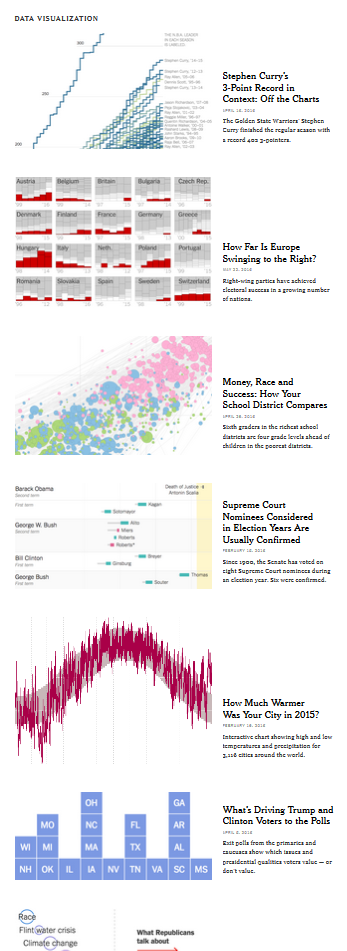

# Part II: Visualization

(SECTION DEVELOPMENT IN PROGRESS)

```{r vissetup, include=FALSE, eval=TRUE, cache=FALSE}
knitr::opts_chunk$set(eval=T, echo=F)
```

## Thinking Visually


### Information

A starting point for data visualization regards the information you want to display, and then how you want to display it.  As in statistical modeling, parsimony is the goal, but not at the cost of the more compelling story.  We don't want to waste the time of the audience or be redundant, but we also want to avoid unnecessary clutter, chart junk, and the like. 

We'll start with a couple examples. Consider the following.

```{r problems}
library(plotly)
sw_height = starwars %>% 
  filter(gender %in% c('male', 'female')) %>% 
  group_by(gender) %>% 
  summarise(Height=mean(height, na.rm=T),
            N= n(),
            se = sd(height, na.rm=T)/sqrt(N))
sw_height %>% 
  ggplot(aes(x=gender, y=Height)) +
  geom_bar(aes(), color='black', stat='identity', width=.5) +
  scale_fill_manual(values=c('red1', 'green')) +
  labs(title='Height of Some Star Wars Characters') +
  theme_bw()
```


So what's wrong with this? Plenty. Aside from being boring, the entire story can be said with a couple words- males are taller than females (even in the Star Wars universe).  There is no reason to have a visualization. And if a simple group difference is the most exciting thing you have to talk about, not many are going to be interested.

Minor issues can also be noted, including unnecessary border around the bars, unnecessary vertical gridlines, and an unnecessary X axis label.

You might think the following is an improvement, but I would say it's even worse.

```{r problems2}
sw_height %>% 
  ggplot(aes(x=gender, y=Height)) +
  geom_errorbar(aes(ymin=Height-2*se, ymax=Height+2*se),
                width=.2,                    # Width of the error bars
                position=position_dodge(.9)) +
  geom_bar(aes(fill=gender), color='black', stat='identity', width=.5) +
  scale_fill_manual(values=c('red1', 'green')) +
  coord_cartesian(ylim=c(140,200)) +
  labs(title='Height of Some Star Wars Characters') +
  theme_bw()
```

Now the y axis has been changed to distort the difference.  Furthermore, color is used but the colors are chosen poorly, and add zero information, thus making the legend superfluous.  And finally, the above doesn't even convey the information people think it does, assuming they are even standard error bars[^barerror], which one typically has to guess about in many journal visualizations of this kind.


Now we add more information, but more problems!

```{r ugly}
starwars %>% 
  filter(gender %in% c('male', 'female')) %>% 
  ggplot(aes(x=mass, y=height)) +
  geom_point(aes(color=gender), size=6) + 
  geom_text(aes(label=name), size=2) + 
  geom_smooth(method='lm', se=F, color='red', lwd=2) + 
  scale_color_manual(values=c('red1', 'green')) +
  theme_linedraw() +
  theme(plot.background=element_rect(color='black'),
        panel.background=element_rect(fill='gray92'),
        panel.grid.major.x=element_line(size=2)
        )
```

The above has unnecessary border, gridlines, and emphasis. The labels, while possibly interesting, do not relate anything useful to the graph, and many are illegible. It imposes a straight (and too wide of a) straight line on a nonlinear relationship.  And finally, color choice is both terrible and tends to draw one's eye to the female data points.  Here is what it looks like to someone with the most common form of colorblindness. If the points were less clumpy on gender, it would be very difficult to distinguish the groups.


And here is what it might look like when printed.

```{r badbw}
starwars %>% 
  filter(gender %in% c('male', 'female')) %>% 
  ggplot(aes(x=mass, y=height)) +
  geom_point(aes(color=gender), size=6) + 
  geom_text(aes(label=name), size=2) + 
  geom_smooth(method='lm', se=F, color='black', lwd=2) + 
  scale_color_grey(start=.6, end=.4) +
  theme_linedraw() +
  theme(plot.background=element_rect(color='black'),
        panel.background=element_rect(fill='gray92'),
        panel.grid.major.x=element_line(size=2)
        )
```

<br>

Now consider the following.  We have six pieces of information in one graph- name (on hover), homeworld (shape), age (size), gender (color), mass (x), and height (y).  The colors are evenly spaced from one another, and so do not draw one's attention to one group over another, or even to the line over groups. Opacity allows the line to be added and points overlap without loss of information.  We technically don't need a caption, legend or gridlines, because hovering over the data tells us everything we'd want to know about a given data point.  

```{r better}
sw2 = starwars %>% 
  filter(gender %in% c('male', 'female')) %>% 
  mutate(homeworld2 = ifelse(homeworld=='Tatooine', 'Tatooine', 'Naboo'),
         homeworld2 = ifelse(homeworld!='Tatooine'& homeworld!='Naboo', 'Other', homeworld2),
         homeworld2 = ifelse(is.na(homeworld2), 'Other', homeworld2)) %>% 
  select(name, mass, height, birth_year, gender, homeworld, homeworld2) %>% ungroup


# adding label=name will add name to plotly tooltip; ggplot will ignore
g = sw2 %>% 
  select(-homeworld) %>% 
  rename(homeworld=homeworld2) %>% 
  ggplot(aes(x=mass, y=height)) +
  geom_smooth(color=lazerhawk::palettes$orange$tetradic[4], se=F, size=.5, alpha=.15) +
  geom_point(aes(label=name, color=gender, shape=homeworld, size=birth_year), alpha=.5, show.legend=F) +
  scale_color_manual(values=lazerhawk::palettes$orange$complementary) +
  # geom_text(aes(label=name)) +
  scale_size_continuous(range=c(2,10)) +
  lazerhawk::theme_trueMinimal()+ 
  theme(legend.position="none")  # only way to keep plotly from putting a legend

ggplotly()%>% 
  # add_lines(x=~mass, y=~height)
  config(displayModeBar = F) %>% 
  layout(title='Star Wars Characters',
         font=list(family='Roboto'),
         xaxis=list(title='Mass'),
         yaxis=list(title='Height'))

# 
# sw2 %>% #drop_na() %>% 
#   # group_by(gender) %>% 
#   plot_ly(split=~gender) %>% 
#   add_markers(x=~mass, y=~height, color=~homeworld2,# colors=c("#1f77b4", "#ff7f0e"),
#               text=~name, size=~birth_year, opacity=.85,# symbol=~gender,
#               sizes=c(50,100)) %>% 
#   lazerhawk::theme_plotly()
```

<br>

Whether this is something you'd prefer or not, the point is that we get quite a bit of information without being overwhelming, and the data is allowed to express itself cleanly.

Here are some things to keep in mind when creating visualizations for scientific communication.


#### Your audience isn't dumb

Assume your audience, which in academia is full of people with advanced degrees or those aspiring to obtain one, can handle more than a bar graph.  If the visualization is good and well-explained[^captions], they'll be fine. 

See the data visualization and maps sections of [2016: The Year in Visual Stories and Graphics](https://www.nytimes.com/interactive/2016/12/28/us/year-in-interactive-graphics.html) at the New York Times.  Good data visualization of even complex relationships can be appreciated by more than an academic audience.  Assume you can at least provide visualizations on that level of complexity and be okay.



#### Clarity is key

Sometimes the clearest message *is* a complicated one.  That's okay, science is an inherently fuzzy process.  Make sure your visualization tells the story you think is important, and don't dumb the story down in the visualization.  People will likely remember the graphic before they'll remember the table of numbers.

By the same token, don't needlessly complicate something that is straightforward.  Perhaps a scatter plot with some groupwise coloring is enough.  That's fine.

All of this is easier said than done, and there is no right way to do data visualizations.  Prepare to experiment.


#### Avoid clutter

Gridlines, 3d, unnecessary patterning, and <span class="emph">chartjunk</span> in general will only detract from the message.  As an example, gridlines might even seem necessary, but even faint ones can potentially hinder the pattern recognition you hope will take place, perceptually imposing clumps of data that do not exist.   In addition, they practically insist on a level of data precision that you simply don't have.  What's more, with interactivity they literally convey nothing additional, as a simple hover-over or click on a data point will reveal the precise values.  Use sparingly, if at all.


#### Color isn't optional

No modern outlet should be a print-first outfit, and if they are, you shouldn't care to send your work there.  The only thing you should be concerned with is how it will look online, because that's how people will interact with your work first and foremost.  That means that color is essentially a requirement for any visualization, so use it well in yours.

#### Think interactively

I would suggest you start by making the visualization you want to make, with interactivity and anything else you like.  You can then reduce as necessary for publication, and keep the fancy one as supplemental, or accessible on your own website.


### Color

There is a lot to consider regarding color.  Until recently, the default color schemes of most visualization packages were poor at best.  Thankfully, <span class="pack">ggplot2</span>, its imitators and extenders, in both the R world and beyond, have made it much easier to have a decent color scheme by default[^jet].

However, the defaults are still potentially problematic, so you should be prepared to go with something else.  In other cases, you may just simply prefer something else.  For example, for me, the gray background of <span class="pack">ggplot2</span> defaults is something I have to remove for every plot[^hadleygray].


#### Viridis

A couple packages will help you get started in choosing a decent color scheme.  One is <span class="pack">viridis</span>.  As stated in the package description:

> These color maps are designed in such a way that they will analytically be perfectly perceptually-uniform, both in regular form and also when converted to black-and-white. They are also designed to be perceived by readers with the most common form of color blindness.

So basically you have something that will take care of your audience without having to do much. There are four palettes.


These color schemes might seem a bit odd from what you're used to.  But recall that the point is scientific communication, and these will allow you to convey information accurately, without implicit bias, and be acceptable in different formats. In addition, there is <span class="pack">ggplot2</span> functionality to boot, e.g. <span class="func">scale_color_viridis</span>, and it will work for discrete or continuous valued data.

For more, see the [vignette](https://cran.r-project.org/web/packages/viridis/vignettes/intro-to-viridis.html). I also invite you to watch the [introduction of the original module in Python](https://www.youtube.com/watch?v=xAoljeRJ3lU), where you can learn more about the issues in color selection, and why viridis works.

#### RColorBrewer

Color Brewer offers another collection of palettes that will generally work well in a variety of situations.  While there are print and color-blind friendly palettes, not all adhere to those restrictions.  Specifically though, you have palettes for the following data situations:

- Qualitative (e.g. Dark2[^Dark1])
- Sequential (e.g. Reds)
- Diverging (e.g. RdBu)


There is a <span class="pack">ggplot2</span> function, <span class="func">scale_color_brewer</span>, you can use as well. For more, see [colorbrewer.org](http://colorbrewer2.org/).  There you can play around with the palettes to help make your decision.


### Contrast

<span class="" style="color:#B3B3B3">Thankfully, websites have mostly gotten past the phase where there text looks like this</span>.  The goal of scientific communication is to, well, *communicate*.  Making text hard to read is pretty much antithetical to this.

So contrast comes into play with text as well as color.  In general, you should consider a 7 to 1 contrast ratio for text, minimally 4 to 1.


-<span class="" style="color:#B3B3B3; size:150%; font-weight:500">Here is text at 2 to 1</span>

-<span class="" style="color:#7f7f7f; size:150%; font-weight:500">Here is text at 4 to 1</span>

-<span class="" style="color:#585858; size:150%; font-weight:500">Here is text at 7 to 1</span>

-<span class="" style="color:black; size:150%; font-weight:500">Here is black</span>

I personally don't like stark black, and find it visually irritating, but obviously that would be fine to use for most people.

### Scaling by Size

You might not be aware, but there is more than one way to scale objects, e.g. in a scatterplot. Consider the following, where in both cases dots are scaled by the person's body-mass index (BMI).


```{r scale_size, out.width='50%'}
sw2 %>% 
  mutate(bmi = mass/((height/100)^2)) %>% 
  ggplot(aes(x=mass, y=height)) +
  geom_point(aes(label=name,  size=bmi), color=palettes$orange$orange, alpha=.25, show.legend=F) +
  scale_size_continuous(range=c(2,10)) +
  lazerhawk::theme_trueMinimal()+ 
  theme(legend.position="none")  # only way to keep plotly from putting a legend
sw2 %>%
  mutate(bmi = mass/((height/100)^2)) %>% 
  ggplot(aes(x=mass, y=height)) +
  geom_point(aes(label=name, size=bmi), color=palettes$orange$orange, alpha=.25, show.legend=F) +
  scale_radius() + 
  lazerhawk::theme_trueMinimal()+ 
  theme(legend.position="none")  # only way to keep plotly from putting a legend
```


The first plot scales the dots by their area, while the second scales the radius, but otherwise they are identical.  It's not generally recommended to scale the radius, as our perceptual system is more attuned to the area.  Packages like <span class="pack">ggplot2</span> and <span class="pack">plotly</span> will automatically do this, but some might not, so you should check.


### Transparency

Using transparency is a great way to keep detailed information available to the audience without being overwhelming. Consider the following.  One-hundred individual trajectories are shown, but it doesn't cause any issue graphically.

```{r transp}
N = 100
obs = 10

g = rep(1:N, e=obs)
x = rep(1:obs, N)
f = rep(c(-.5, .5), e=N/2)[g]
# sig = createCorr(c(-.75,-.25,.25))
# re = mvtnorm::rmvnorm(N, sigma=sig)
re = mvtnorm::rmvnorm(N, sigma=diag(c(.5,.05,.025)))
y = re[,1][g] + (.25+re[,2][g])*x + (re[,3][g]*f)*(x^2) + rnorm(N*obs, sd=.2)
library(lme4)
xsq = x^2
lmer(y ~ x + xsq + (1+x+xsq |g))
# y = scale(y)[,1]

# lm(y~poly(x,2)) %>% summary()

# 
# gg = data_frame(g, x, y) %>% 
#   mutate(y = scale(y)) %>% 
#   ggplot(aes(x,y)) + 
#   geom_smooth(aes(group=g), se=F, color=alpha(palettes$orange$orange, .2), lwd=.5)
# ggplotly() %>% 
#   theme_plotly()
data_frame(g, f=factor(f, labels=c('g1','g2')), x, y) %>% 
  group_by(g) %>% 
  mutate(updown = if_else(last(y) > first(y), 'up', 'down')) %>% 
  # ungroup() %>%
  plot_ly() %>% 
  add_lines(x=~x, y=~y,  color=~f, opacity=.25, showlegend=F) %>%
  add_markers(x=~x, y=~y, color=~f, opacity=.75) %>% 
  theme_plotly()
```


Without transparency, it just looks ugly and notably busier if nothing else.

```{r transp2}
data_frame(g, x, y) %>% 
  group_by(g) %>% 
  mutate(updown = if_else(last(y) > first(y), 'up', 'down')) %>% 
  # ungroup() %>%
  plot_ly() %>% 
  add_lines(x=~x, y=~y,  color=~updown, showlegend=F) %>%
  add_markers(x=~x, y=~y, color=~updown) %>% 
  theme_plotly()
```

In addition, transparency can be used to add additional information, e.g. data density in scatter plots.


```{r transp_tornado, eval=F}
# data(flights, package='threejs') 
# flights %>% 
#   plot_ly(x=~origin_long, y=~origin_lat) %>% 
#   add_markers(opacity=.20, size=I(3), color=I('#ff5500')) %>% 
#   theme_plotly()

load('../../Other/Tornado/data/tornados.RData')
g <- list(
  scope = 'usa',
  projection = list(type = 'albers usa'),
  showland = TRUE,
  landcolor = toRGB("gray95"),
  subunitcolor = toRGB("gray85"),
  countrycolor = toRGB("gray85"),
  countrywidth = 0.5,
  subunitwidth = 0.5
)

tornados %>% 
  filter(Year>=2010) %>% 
  plot_geo(lat = ~StartLat, lon = ~StartLon) %>%
  add_markers(size = I(3.5), color=I('#ff5500'), opacity=.25) %>%
  layout(title = 'U.S. Tornados 1990-2015', geo = g) %>% 
  theme_plotly()

```


### Things to avoid

pie charts and their cousins

- bar chart (and stacked versions)
- wind rose

histograms

- use density

using 3d without adding any communicative value

- which is almost always
- prefer interactivity
- Where is it useful: showing structure (e.g. molecular, geographical), continuous multi-way interactions

using too many colors

### WebAxe


### Thinking Visually Exercises

#### Exercise 1

The following uses the <span class="objclass">diamonds</span> data set that comes with <span class="pack">ggplot2</span>.  

```{r thinkingvis_ex1, echo=T, eval=FALSE, cache=FALSE}
library(ggplot2); library(viridis)
ggplot(aes(x=carat, y=price), data=diamonds) +
  geom_point(aes(color=price)) +
  ????
```

```{r thinkingvis_ex1b, echo=F, out.width='50%'}
library(ggplot2); library(viridis)
ggplot(aes(x=carat, y=price), data=diamonds) +
  geom_point(aes(color=price)) +
  scale_color_viridis()
```

#### Exercise 2

Now color it by the `cut`.  To use the scale_color_viridis approach, you'll have to change one of the arguments to the function.  Reproduce this but using one of the other viridis palettes.

```{r thinkingvis_ex2, out.width='50%'}
ggplot(aes(x=carat, y=price), data=diamonds) +
  geom_point(aes(color=cut)) +
  scale_color_viridis(discrete=T)
```

#### Thinking exercises

For your upcoming presentation, *who* is your audience?


[^barerror]: Error bars for group means can overlap and still be statistically different (the test regards the *difference* in means).  Furthermore most visuals of this sort don't bother to say whether it is standard deviation, standard error, or 2*standard error, or even something else.

[^captions]: People seem to think there are text limits for captions.  There are none.

[^jet]: Even Matlab finally joined the club, except that they still screwed up with their default coloring scheme.

[^hadleygray]: Hadley states "The grey background gives the plot a similar colour (in a typographical sense) to the remainder of the text, ensuring that the graphics fit in with the flow of a text without jumping out with a bright white background. Finally, the grey background creates a continuous field of colour which ensures that the plot is perceived as a single visual entity.".  The part about it being ugly is apparently left out. ☺  Also, my opinion is that it has the opposite effect, making the visualization jump out because nothing on the web is gray by default. If anything the page background is white, and having a white/transparent background would perhaps be better, but honestly, don't you *want* a visualization to jump out?

[^Dark1]: Don't even think about asking what the Dark1 palette is.