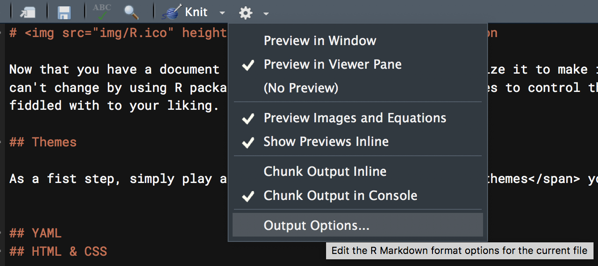
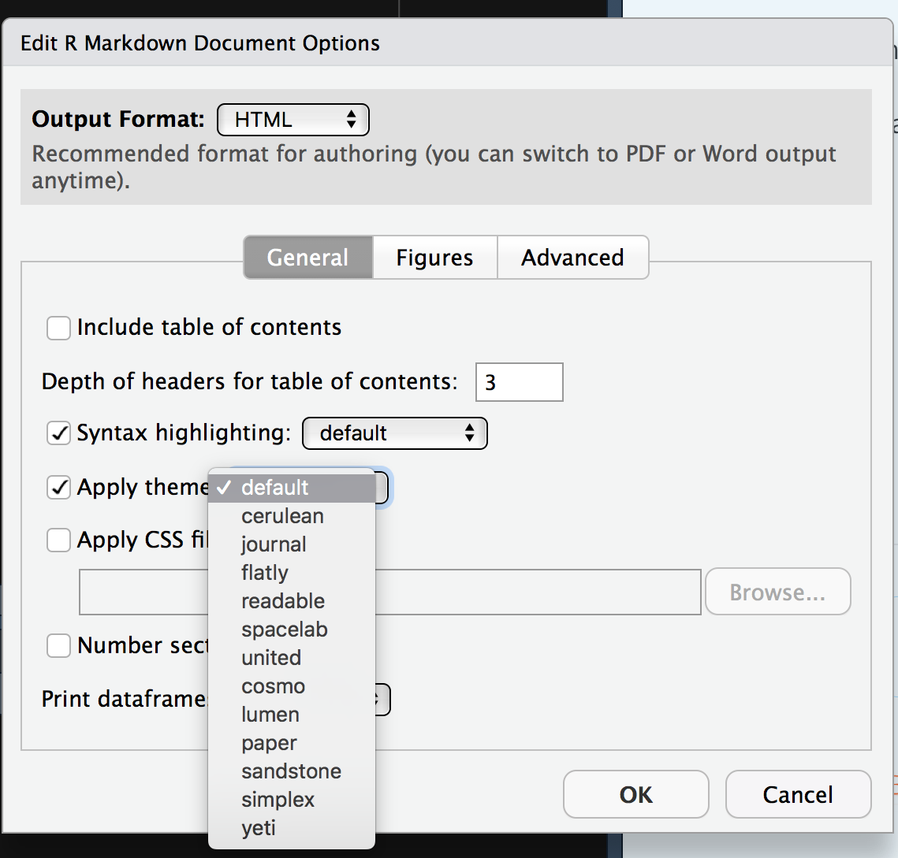
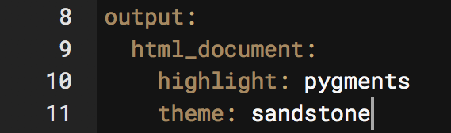
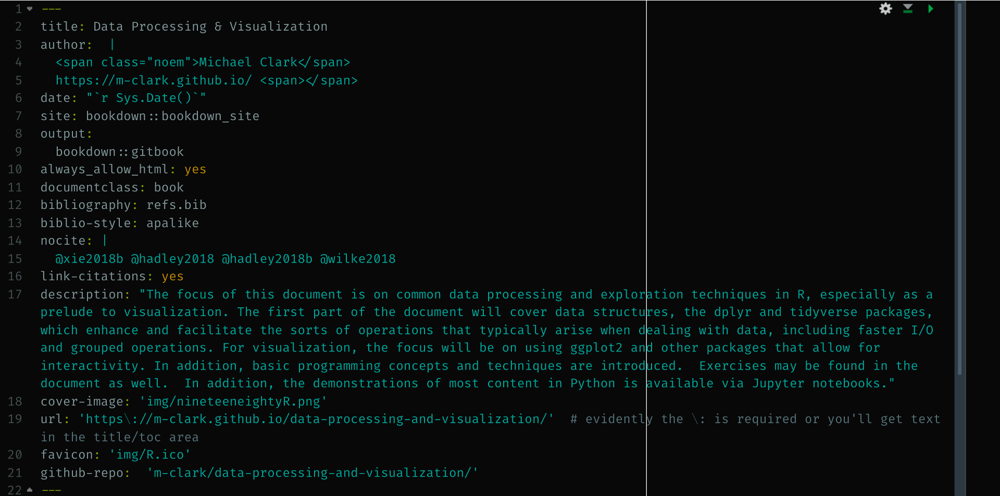
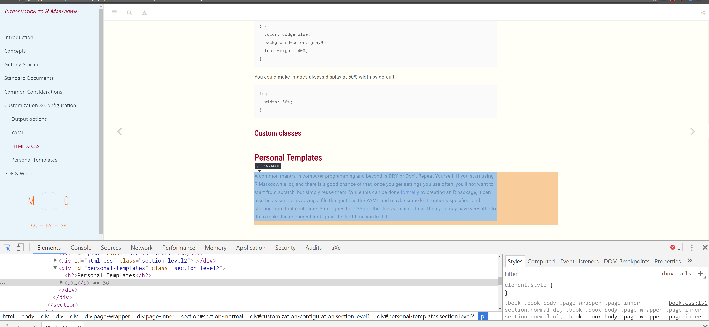

# Customization & Configuration

Now that you have a document ready to go, you'll want to customize it to make it look the way you want.  There is basically nothing you can't change by using R packages to enhance output, using custom themes to control the overall look, and using various other tools to your liking.


## Output options

The basic document comes with several options to apply to your output.  You'll find a cog wheel in the toolbar area underneath the tabs.



Note that the inline vs. console stuff mostly just has to do with the actual .Rmd file, not the output, so we're going to ignore it[^inline]. Within the options you can apply some default settings to images, code, and more. 

### Themes etc.

As a first step, simply play around with the <span class="emph">themes</span> you already have available.  For quick, one-off documents that you want to share without a lot of fuss, choosing one of these will make your document look good without breaking a sweat.



As another example, choose a new code style with the syntax highlighting.  If you have headings in your current document, go ahead and turn on table of contents.

For many of the documents you create, changing the defaults this way may be enough, so be familiar with your options.  

After making your selections, now see what has changed at the top of your document.  You might see something like the following.




I'm sure you've been wondering at this point, so what is that stuff anyway?  That is <span class="emph">YAML</span>[^yaml].  So let's see what's going on.


## YAML

For the purposes of starting out, all you really need to know is that YAML is like configuration code for your document.  You can see that it specifies what the output is, and whatever options you selected previously.  You can change the title, add a date etc.  There is a lot of other stuff too.  Here is the YAML for this document.



Clearly, there is a lot to play with, but it will depend on the type of document you're doing.  For example, the `always_allow_html: yes` is pointless for an HTML document, but would allow certain things to be (very likely poorly) attempted in a PDF or Word document.  Other options *only* make sense for bookdown documents.

There is a lot more available too, as YAML is a programming syntax all its own, so how deep you want to get into it is up to you.  The best way, just like learning R Markdown generally, is to simply see what others do and apply it to your own document.  It may take a bit of trial and error, but you'll eventually get the hang of it.

## HTML & CSS

### HTML

Knowing some basic HTML can add little things to your document to make it look better.  As a minimal example, here is a plot followed by text.


```{r plotly_text, echo=FALSE, out.width='50%'}
mgcv::gamSim(verbose = F) %>%
  modelr::add_predictions(., model = mgcv::gam(y ~ s(x2), data = .)) %>%
  plot_ly(x =  ~ x2, y =  ~ y) %>%
  add_lines(
    color = I(palettes$stan_red$complementary[2]),
    showlegend = F,
    opacity = .5
  ) %>%
  add_lines(
    y =  ~ pred,
    color = I(palettes$stan_red$stan_red),
    showlegend = F
  ) %>%
  theme_plotly()
```

Even with a return space between this line you are reading and the plot, this text is smack against it. I do not prefer this.


This fix is easy, just add `<br>` after the R chunk that creates the plot to add a line break.

```{r plotly_text2, echo=FALSE, out.width='50%'}
mgcv::gamSim(verbose = F) %>%
  modelr::add_predictions(., model = mgcv::gam(y ~ s(x2), data = .)) %>%
  plot_ly(x =  ~ x2, y =  ~ y) %>%
  add_lines(
    color = I(palettes$stan_red$complementary[2]),
    showlegend = F,
    opacity = .5
  ) %>%
  add_lines(
    y =  ~ pred,
    color = I(palettes$stan_red$stan_red),
    showlegend = F
  ) %>%
  theme_plotly()
```

<br>

This text has some room to breathe.  Alternatively, I could use <span class="pack">htmltools</span> and put `br()` in the code after the plot.  Possibly the best option would be to change the CSS regarding images so that they all have a bit of padding around them.

While you have a CSS file to make such changes, you can also do so in-line.

<span class='myclass' style="color:#66023C; font-size:150%; font-weight:600">This sentence is tyrian purple, bold, and has bigger font because I put `<span style='color:#66023C; font-size:150%; font-weight:600'>` before it and `</span>` after it.</span>


Say you want to center and resize an image.  Basic Markdown is too limited to do much more than display the image, so use some HTML instead.

Here is the basic markdown image.

``


A little more functionality has been added to the default approach, such that you can add some options in the following manner (no spaces!).

`{width=25%}`

{width=25%}


Next we use HTML instead.  This will produce a centered image that is slightly smaller.

``


While the `src` and `width` are self-explanatory, the style part is where you can do one-off CSS styling, which we'll talk about next.  In this example, it serves to center the image. Taking `display: block` out and changing the margins to 0 will default to left-alignment within the part of the page (container) the image resides in.

``


We can also use an R chunk with code as follows, which would allow for adjustments via chunk options.

```{r include_graphics}
knitr::include_graphics('img/R.ico')
```


And finally, you'll want to is hone your ASCII art skills, because sometimes that's the best way to display an image, like this ocean sunset.


```
           ^^                   @@@@@@@@@
      ^^       ^^            @@@@@@@@@@@@@@@
                           @@@@@@@@@@@@@@@@@@              ^^
                          @@@@@@@@@@@@@@@@@@@@
~~~~ ~~ ~~~~~ ~~~~~~~~ ~~ &&&&&&&&&&&&&&&&&&&& ~~~~~~~ ~~~~~~~~~~~ ~~~
~         ~~   ~  ~       ~~~~~~~~~~~~~~~~~~~~ ~       ~~     ~~ ~
  ~      ~~      ~~ ~~ ~~  ~~~~~~~~~~~~~ ~~~~  ~     ~~~    ~ ~~~  ~ ~~
  ~  ~~     ~         ~      ~~~~~~  ~~ ~~~       ~~ ~ ~~  ~~ ~
~  ~       ~ ~      ~           ~~ ~~~~~~  ~      ~~  ~             ~~
      ~             ~        ~      ~      ~~   ~             ~

```


### CSS


Recall the style section in some of the HTML examples above. For example, the part `style='color:#66023C; font-size:150%; font-weight:600'` changed the font[^css].  It's actually CSS, and if we need to do the same thing each time, we can take an alternative approach to creating a style that would apply the same settings to all objects of the same class or HTML tag throughout the document.

The first step is to create a `*.css` file that your R Markdown document can refer to. Let's say we want to make every link <span style='color:dodgerblue'>dodgerblue</span>.  Links in HTML are tagged with the letter **`a`**, and to insert a link with HTML you can do something like:

```
<a href='https://m-clark.github.io>wowee zowee!</a>
```

It would look like this: <a href='https://m-clark.github.io'>wowee zowee!</a>.  If we want to change the color from the default setting for all links, we go into our CSS file.

```css
a {
  color: dodgerblue;
}
```

Now our links would look like this: <a href='https://m-clark.github.io' style="color:dodgerblue">wowee zowee!</a>

You can use hexadecimal, RGB and other representations of practically any color. CSS, like HTML, has a fairly simple syntax, but it's very flexible, and can do a ton of stuff you wouldn't think of.  With experience and looking at other people's CSS, you'll pick up the basics.

Now that you have a CSS file. Note that you want to specify it in the YAML section of your R Markdown document.

```yaml
output:
  html_document:
    css: mystyle.css
```

Now every link you create will be that color.  We could add a subtle background to it, make them bold or whatever.


```css
a {
  color: dodgerblue;
  background-color: #f2f2f2;
  font-weight: 800;
}
```

Now it becomes <a href='https://m-clark.github.io' style="color:dodgerblue; background: #f2f2f2;font-weight: 800;">wowee zowee!</a>. In a similar fashion, you could make images always display at 50% width by default.

```css
img {
  width: 50%;
}
```


### Custom classes

You can also create custom classes.  For example, all R functions in my documents are a specific color, as they are wrapped in a custom css class I created called 'func' as follows[^classidtag]. 

```css
.func {
  color: #007199;  
  font-weight: 500;
}
```

Then I can do `<span class="func">crossprod</span>` and the text of the function name, or any text of class func, will have the appropriate color and weight.


## Personal Templates

A common mantra in computer programming and beyond is DRY, or Don't Repeat Yourself.  If you start using R Markdown a lot, and there is a good chance of that, once you get some settings you use often, you'll not want to start from scratch, but simply reuse them.  While this can be done [formally](https://rmarkdown.rstudio.com/developer_document_templates.html) by creating an R package, it can also be as simple as saving a file that just has the YAML and maybe some <span class="pack">knitr</span> options specified, and starting from that file each time.  Same goes for CSS or other files you use often. 

Over time, these files and settings will grow, especially as you learn new options and want to tweak old.  In the end, you may have very little to do to make the document look great the first time you knit it!


## The Rabbit Hole Goes Deep

How much you want to get into customization is up to you.  Using the developer tools of any web browser allows you to inspect what anyone else has done as far as styling with CSS.  Here is an example of Chrome Developer Tools, which you can access through its menus.



<br>

All browsers have this, making it easy to see exactly what's going on with any webpage.


For some of you, if you aren't careful, you'll spend an afternoon on an already finished document trying to make it look perfect.  It takes very little effort to make a great looking document with R Markdown.  Making it *perfect* is impossible.  You have been warned.

[^inline]: I haven't yet figured out the utility in having figures and output breaking up the flow of code and text along with everything else going on, especially since they'll be precisely where they need to be in the final product. Just my opinion though.

[^yaml]: [YAML](https://en.wikipedia.org/wiki/YAML) used to stand for Yet Another Markup Language, and now stands for YAML Aint Markup Language, presumably for reasons no one but the developers care about.

[^css]: **CSS** stands for **c**ascading **s**tyle **s**hheets.

[^classidtag]: In CSS, tags like **a**, **table**, and **img**, have no marker, classes are denoted with **.classname**, and IDs are note with **#idname**.