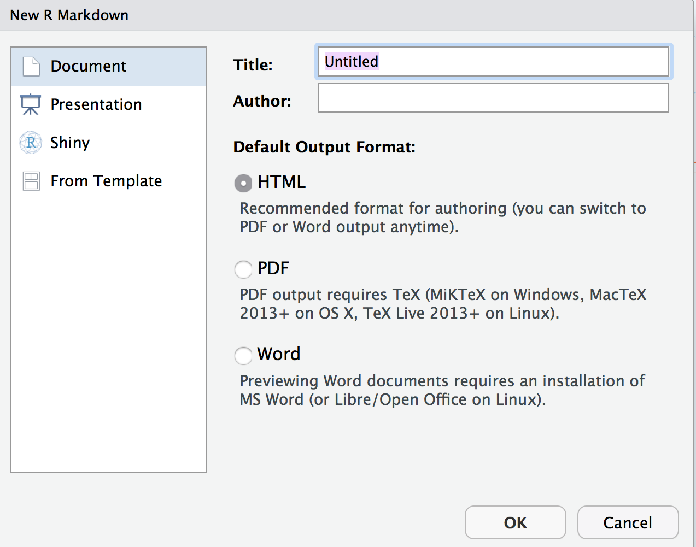
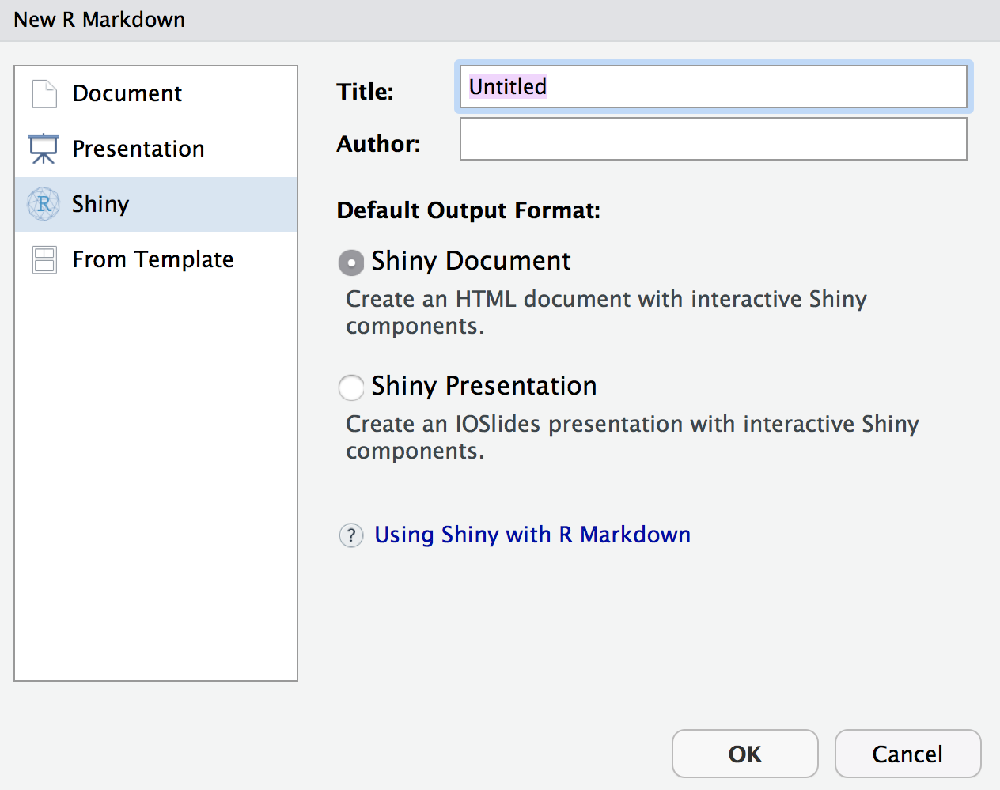
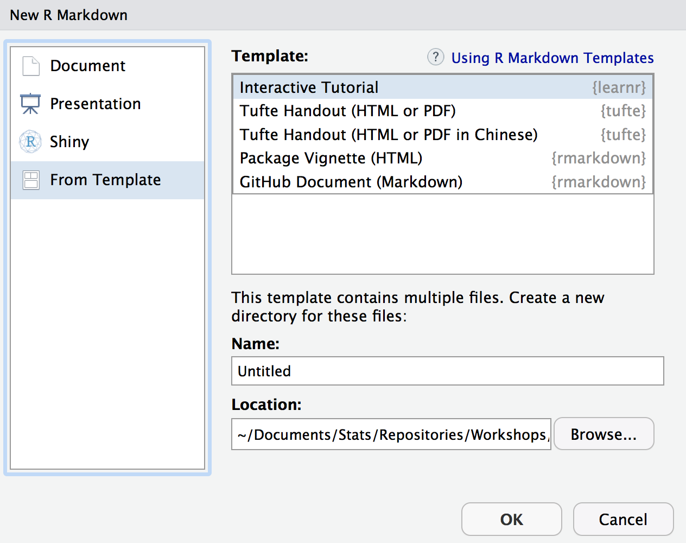

# Getting Started

<br>

<br>


## What is Markdown?

<br>

<br>

<span class="emph">Markdown</span> is basically a syntax (a markup language) that conveys how text should be displayed. In practice, it allows you to use plain text for a document with bits of other things thrown in, but which will ultimately be converted to any number of other languages, especially HMTL, for eventual display in a format you desire.  

The basic markdown syntax hasn't even really been developed for many years, but there are now dozens of *flavors*, of which R Markdown is one. Most Markdown syntax is preserved and works identically no matter what flavor you use.  However, the different flavors will have different options or slightly different implementations of certain things.  The main point is knowing one flavor means you know some Markdown, and thus would easily work with others. 


## Documents

To start using R Markdown, simply go to `File/New File/R Markdown...`

<br>

<br>

As you can see right away, you have your choice of several types of formats, some of which will be of interest to you as you get more used to using R Markdown.


Documents are what you'll probably use primarily, especially since they can be used in place of normal R scripts. You have the choice of HTML, PDF and MS Word.  The main thing you'll want to do is make your choice early, because it is not really possible to have the document look like exactly how you'd want in all formats simultaneously.  As this format is the focus of this document, more detail is forthcoming, but we'll cover some general options.

### Standard HTML

As mentioned, the default, and likely most commonly used document for R Markdown is the standard, single-page HTML document.  It is highly flexible, has several default themes available, works well for short or longer works, different screen sizes, etc.  Some of the other different formats (e.g. presentations) are variations of it.  You will probably want to get comfortable with it before moving on to other types of formats, but it will serve you well even as you advance your R Markdown skills.

### R Notebooks

Many are using <span class="emph">R Notebooks</span> as their primary scripting tool, and these are definitely something to consider for your own approach.  While there are some drawbacks in efficiency, many like the feel of them.  In my experience, they lack the smooth approach of Jupyter Notebooks, and they really aren't as suited to publishable work as the standard R Markdown document (at least I've had issues). Having your output inline also means you may be looking at stale results that don't reflect previous data changes, and it's easy for a few lines of code to become what would be equivalent to several printed pages of output.  Again though, they might be useful for some purposes.

### Distill

One of the newer formats for R Markdown is the <span class="emph">Distill</span> template.  It is specifically suited toward scientific publishing, and is very visually appealing (in my opinion).  Along with some subtle alternative default settings relative to the standard HTML document, it has asides (marginal presentation), hover-over citations and footnotes, easy incorporation of metadata (e.g. license, author contribution), and other useful things that are, or should be, common to a scientific publication.  You can even create a website with it ([as I have](https://m-clark.github.io))!

### Bookdown

You're reading the output of a <span class="emph">Bookdown</span> template now.  You might not think you will have that much to say, but if you are using a standard HTML document and it tends to get notably long, you might prefer the bookdown format to the constant scrolling.  You could even use it for a slide-like presentation, but with a lot more flexibility.  Many R publications, and more all the time, are being published via bookdown rather than traditional print (or both).  See [bookdown.org](https://bookdown.org/) and [my own website](https://m-clark.github.io) for more examples.


## Presentations

<br>

<br>

You can do slide-style presentations with R Markdown, with three options shown, though two are bizarrely absent.  Two shown are HTML based, and you should not even consider Beamer/pdf (i.e. $\LaTeX$).  Slides are not for printing, and in fact, really don't work for text in general.  They should be very visual if they are to be effective.  The two notable formats not shown are [revealjs](http://rmarkdown.rstudio.com/revealjs_presentation_format.html)[^revealjs] and the kind you can create by going to `File/New File/R Presentation`, which is also revealjs but a different format.  I do not recommend the latter.  In addition, many seem to be really high on [xaringan](https://github.com/yihui/xaringan), which is based on <span class="emph">remarkjs</span>, but I am not sure what it offers over the others.

Creating a presentation is easy enough, and the following shows an example.

```
---
title: "Habits"
output: ioslides_presentation
---

# In the morning

## Getting up

- Turn off alarm
- Get out of bed

## Breakfast

- Eat eggs
- Drink coffee

# In the evening

## Dinner

- Eat spaghetti
- Drink wine
```

You should really question whether you need slides.  They are a unnecessarily restrictive format, do not work well with text, and often don't work well with interactive visualizations.  Furthermore, their development doesn't appear to be as much of a priority for the RStudio crowd relative to other formats (rightly so in my opinion).  And finally, there is nothing substantive they offer that can't be done with a standard HTML doc or its variants.


## Apps, Sites & Dashboards

<br>

<br>

<span class="emph">Shiny</span> is an inherently interactive format geared toward the creation of websites and applications.  While there are far more apt programming languages than R for creating a website/app, at least Shiny allows you to stay completely within the R environment, and that means you don't have to be expert in those other languages.

You can run shiny apps on your machine well enough, though usually the point is to make something other people can interact with.  This means you'll need some place to house your work, and [shinyapps.io](https://www.shinyapps.io) allows for some free hosting and other options.  As long as you have a web server people will be able to access your work.  Other formats in this area to be aware of are `websites` and `flexdashboard`.


## Templates

<br>

<br>

Templates are available for any number of things, and one can find plenty among specific packages.  Once a package with a particular template is installed, you'll then have it as an option here.  All these typically do is provide an R Markdown file similar to when you open a document, with a couple specific options, and demonstration of them if applicable.  It's not much, but at least it will save you a little effort.

After you get the hang of R Markdown, you should strongly consider making your own template. It's actually pretty easy, and then you'll always have the option.


## How to Begin

The best way to get started with R Markdown is to see a document you like, copy the relevant parts for your own document, and get to it!  It really is the best way in my opinion.  Many people host their files on [GitHub](https://github.com), so you can just download it directly from there.  The author of <span class="pack">bookdown</span>, a particular format for R Markdown, actually suggests people simply clone his repository for his book that teaches bookdown, and go from there.  That's how I started using <span class="pack">bookdown</span>, which became my favored format for longer documents, and even presentations.  Now bookdown is available as a template as well.

In summary, just see what others are doing, and then tailor it to your own needs.


[^revealjs]: When I did slides more often I found revealjs the most viable format. The fact that it's listed second among the slide formats on the R Markdown website yet not a default when choosing, while the base R Presentation isn't even mentioned on the website, probably speaks to how much the RStudio folks are interested in their development relative to other things, which is to say not much.