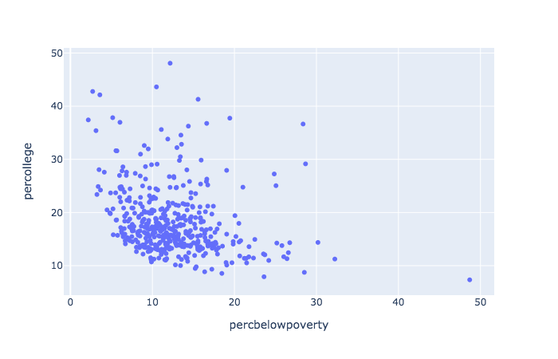
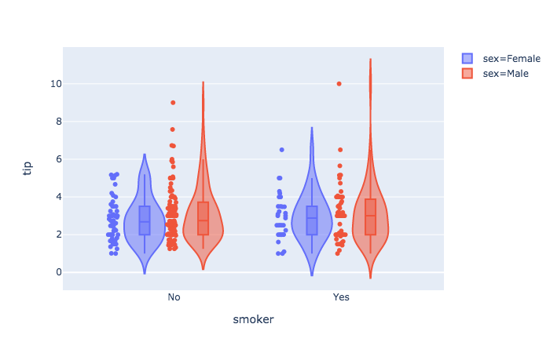
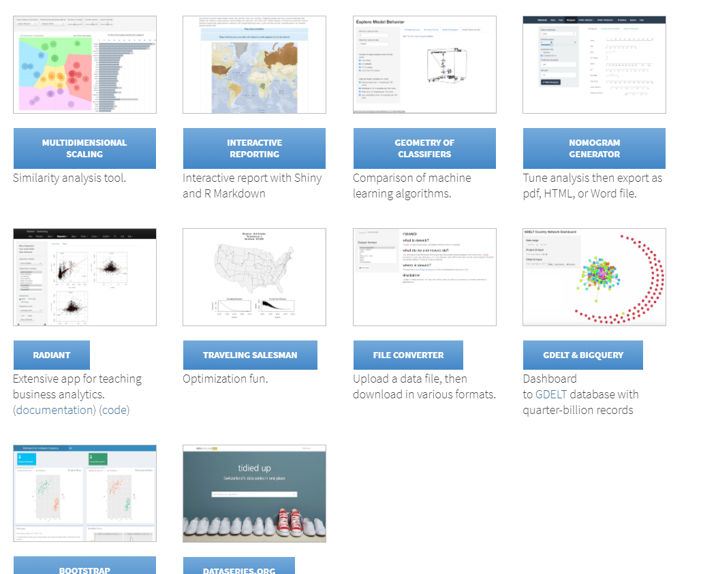

# Interactive Visualization


```{r interactivesetup, include=FALSE, eval=TRUE, cache=FALSE}
knitr::opts_chunk$set(cache.rebuild=T)
library(ggplot2)
```

```{r title, echo=F, eval=T}
# saveWidget(vn, file='vntitle.html')
library(visNetwork)
nodes = data.frame(id=1:2, label=c('Interactive', 'Visualization'))
edges = data.frame(from=1, to=2, color='transparent')
# visNetwork(nodes, edges, height=400, width='100%') %>% 
#   visNodes(shape='text', font=list(color=palettes$tyrian_purple2$tyrian_purple, size=64)) %>% 
#   visOptions(highlightNearest=F) 
visNetwork(nodes, edges, height=400, width='100%') %>% 
  visNodes(shape='circle', 
           color = list(background='#fffff8', 
                        # highlight=col2rgb(palettes$tyrian_purple$tetradic[2], .25)[,1],
                        highlight='rgba(2,102,44,.5)',
                        border=palettes$tyrian_purple2$tyrian_purple),
           borderWidth = 3,
           size=50, 
           label='text', 
           font=list(color=palettes$tyrian_purple2$tyrian_purple,
                     size=24,
                     highlight='#ffffff8'),
           shadow = T) %>% 
  visOptions(highlightNearest=F) 
```

<!-- <iframe src='../img/vntitle.html', width=800, height=300, scrolling="no", frameBorder="0"></iframe> -->


## Packages

As mentioned, <span class="pack">ggplot2</span> is the most widely used package for visualization in R. However, it is not interactive by default. Many packages use <span class="pack">htmlwidgets</span>, <span class="pack">d3</span> (JavaScript library), and other tools to provide interactive graphics.  What's great is that while you may have to learn new packages, you don't necessarily have to change your approach or thinking about a plot, or learn some other language.

Many of these packages can be lumped into more general packages that try to provide a plotting system (similar to <span class="pack">ggplot2</span>), versus those that just aim to do a specific type of plot well.  Here are some to give a sense of this.

General (click to visit the associated website):

- [plotly](https://plot.ly/r/)
      - used also in Python, Matlab, Julia
      - can convert <span class="pack">ggplot2</span> images to interactive ones (with varying degrees of success)
- [highcharter](http://jkunst.com/highcharter/)
    - also very general wrapper for highcharts.js and works with some R packages out of the box
- [rbokeh](http://hafen.github.io/rbokeh/)
    - like plotly, it also has cross language support

Specific functionality:

  - [DT](https://rstudio.github.io/DT/)
    - interactive data tables
  - [leaflet](https://rstudio.github.io/leaflet/)
      - maps with OpenStreetMap
  - [visNetwork](http://datastorm-open.github.io/visNetwork/)
      - Network visualization
  
In what follows we'll see some of these in action.  Note that unlike the previous chapter, the goal here is not to dive deeply, but just to get an idea of what's available.

## Piping for Visualization

One of the advantages to piping is that it's not limited to <span class="pack">dplyr</span> style data management functions. <span class='emph'>*Any*</span> R function can be potentially piped to, and several examples have already been shown. Many newer visualization packages take advantage of piping, and this facilitates data exploration. We don't have to create objects just to do a visualization.  New variables can be easily created and subsequently manipulated just for visualization. Furthermore, data manipulation not separated from visualization.


## htmlwidgets

The <span class='pack'>htmlwidgets</span> package makes it easy to create visualizations based on JavaScript libraries.  If you're not familiar with JavaScript, you actually are very familiar with its products, as it's basically the language of the web, visual or otherwise.  The R packages using it typically are pipe-oriented and produce interactive plots.  In addition, you can use the <span class='pack'>htmlwidgets</span> package to create your own functions that use a particular JavaScript library (but someone probably already has, so look first).


## Plotly {.tabset}

We'll begin our foray into the interactive world with a couple demonstrations of <span class="pack">plotly</span>.  To give some background, you can think of plotly similar to RStudio, in that it has both enterprise (i.e. pay for) aspects and open source aspects.  Just like RStudio, you have full access to what it has to offer via the open source R package.  You may see old help suggestions referring to needing an account, but this is no longer necessary.  


When using <span class="pack">plotly</span>, you'll note the layering approach similar to what we had with <span class="pack">ggplot2</span>.  Piping is used before plotting to do some data manipulation, after which we seamlessly move to the plot itself.  The `=~` is essentially the way we denote aesthetics[^plotlyaes].  


Plotly is able to be used in both R and Python.

#### R

```{r plotly1}
library(plotly)

midwest %>%
  filter(inmetro == T) %>%
  plot_ly(x =  ~ percbelowpoverty, y =  ~ percollege) %>%
  add_markers()
```

#### Python

The following does the same plot in Python

```{python basic-plotly, eval=FALSE}
import pandas as pd

import plotly.express as px

midwest = pd.DataFrame(r.midwest)  # from previous chunk using reticulate

plt = px.scatter(midwest, x = 'percbelowpoverty', y = 'percollege')

plt.show() # opens in browser
```


```{r basic-plotly-show,  echo=FALSE}

```

<br>

### Modes

<span class="pack">plotly</span> has <span class="emph">modes</span>, which allow for points, lines, text and combinations. <span class="emph">Traces</span>, `add_*`, work similar to geoms.

```{r plotly2}
library(mgcv)
library(modelr)
library(glue)

mtcars %>%
  mutate(
    amFactor = factor(am, labels = c('auto', 'manual')),
    hovertext = glue('weight: {wt} <br> mpg: {mpg} <br> {amFactor}')
  ) %>%
  add_predictions(gam(mpg ~ s(wt, am, bs = 'fs'), data = mtcars)) %>%
  arrange(am) %>% 
  plot_ly() %>%
  add_markers(
    x =  ~ wt,
    y =  ~ mpg,
    color =  ~ amFactor,
    opacity = .5,
    text =  ~ hovertext,
    hoverinfo = 'text',
    showlegend = F
  ) %>%
  add_lines(
    x =  ~ wt,
    y =  ~ pred,
    color =  ~ amFactor
  )
```

<br>

While you can use plotly as a one-liner[^qplot], this would only be good for quick peeks while doing data exploration. It would generally be far too limiting otherwise.

```{r plotly_1line, eval = T}
plot_ly(ggplot2::midwest, x = ~percollege, color = ~state, type = "box")
```

And here is a Python example or two using plotly express.

```{python express, eval=FALSE}
plt = px.box(midwest, x = 'state', y = 'percollege', color = 'state', notched=True)

plt.show() # opens in browser

tips = px.data.tips()  # built-in dataset

px.violin(
  tips, 
  y      = "tip", 
  x      = "smoker", 
  color  = "sex", 
  box    = True, 
  points = "all", 
  hover_data = tips.columns
).show()
```


```{r express-show, out.width='75%', echo=FALSE}
knitr::include_graphics('img/plotly-box-python.png')

```


### ggplotly

One of the strengths of  <span class="pack">plotly</span> is that we can feed a <span class="objclass">ggplot</span> object to it, and turn our formerly static plots into interactive ones.  It would have been easy to use <span class="func">geom_smooth</span> to get a similar result, so let's do so.


```{r ggplotly}
gp = mtcars %>%
  mutate(amFactor = factor(am, labels = c('auto', 'manual')),
         hovertext = paste(wt, mpg, amFactor)) %>%
  arrange(wt) %>%
  ggplot(aes(x = wt, y = mpg, color = amFactor)) +
  geom_smooth(se = F) +
  geom_point(aes(color = amFactor))

ggplotly()
```

<br>

Note that this is not a one-to-one transformation.  The plotly image will have different line widths and point sizes. It will usually be easier to change it within the ggplot process than tweaking the <span class="objclass">ggplotly</span> object.

<div class='note'>
Be prepared to spend time getting used to plotly.  It has (in my opinion) poor documentation, is not nearly as flexible as ggplot2, has hidden (and arbitrary) defaults that can creep into a plot based on aspects of the data (rather than your settings), and some modes do not play nicely with others.  That said, it works great for a lot of things, and I use it regularly.

 
</div>


## Highcharter

<span class="pack">Highcharter</span> is also fairly useful for a wide variety of plots, and is based on the <span class="pack">highcharts.js</span> library.  If you have data suited to one of its functions, getting a great interactive plot can be ridiculously easy.  

In what follows we use <span class="pack">quantmod</span> to create an <span class="pack">xts</span> (time series) object of Google's stock price, including opening and closing values.  The highcharter object has a ready-made plot for such data[^nobigdeal].

```{r highcharts}
library(highcharter)
library(quantmod)

google_price = getSymbols("GOOG", auto.assign = FALSE)
hchart(google_price)
```

## Graph networks 

### visNetwork

The <span class="pack">visNetwork</span> package is specific to network visualizations and similar, and is based on the <span class="pack">vis.js</span> library.  Networks require nodes and edges to connect them. These take on different aspects, and so are created in separate data frames.

```{r visNetworkinitial, cache=FALSE}
set.seed(1352)
nodes = data.frame(id = 0:5,
                   label = c('Bobby', 'Janie','Timmie', 'Mary', 'Johnny', 'Billy'),
                   group = c('friend', 'frenemy','frenemy', rep('friend', 3)),
                   value = sample(10:50, 6))
edges = data.frame(from = c(0,0,0,1,1,2,2,3,3,3,4,5,5),
                   to = sample(0:5, 13, replace = T),
                   value = sample(1:10, 13, replace = T)) %>% 
  filter(from!=to)

library(visNetwork)
visNetwork(nodes, edges, height=300, width=800) %>%
  visNodes(shape='circle', 
           font=list(), 
           scaling=list(min=10, max=50, label=list(enable=T))) %>% 
  visLegend()
```


### sigmajs

The <span class="pack" style = "">sigmajs</span> package allows one to use the corresponding JS library to create some clean and nice visualizations for graphs.  The following creates 

```{r sigmajs, cache=FALSE}
library(sigmajs)

nodes <- sg_make_nodes(30)
edges <- sg_make_edges(nodes)

# add transitions
n <- nrow(nodes)
nodes$to_x <- runif(n, 5, 10)
nodes$to_y <- runif(n, 5, 10)
nodes$to_size <- runif(n, 5, 10)
nodes$to_color <- sample(c("#ff5500", "#00aaff"), n, replace = TRUE)


sigmajs() %>%
  sg_nodes(nodes, id, label, size, color, to_x, to_y, to_size, to_color) %>%
  sg_edges(edges, id, source, target) %>%
  sg_animate(
    mapping = list(
      x = "to_x",
      y = "to_y",
      size = "to_size",
      color = "to_color"
    ),
    delay = 0
  ) %>%
  sg_settings(animationsTime = 3500) %>%
  sg_button("animate", # button label
            "animate", # event name
            class = "btn btn-warning")
```

### Plotly

I mention plotly capabilities here as again, it may be useful to stick to one tool that you can learn well, and again, could allow you to bounce to python as well.

```{python network, eval = FALSE}
import plotly.graph_objects as go
import networkx as nx

G = nx.random_geometric_graph(50, 0.125)

edge_x = []
edge_y = []
for edge in G.edges():
    x0, y0 = G.nodes[edge[0]]['pos']
    x1, y1 = G.nodes[edge[1]]['pos']
    edge_x.append(x0)
    edge_x.append(x1)
    edge_x.append(None)
    edge_y.append(y0)
    edge_y.append(y1)
    edge_y.append(None)

edge_trace = go.Scatter(
    x=edge_x,
    y=edge_y,
    line=dict(width=0.5, color='#888'),
    hoverinfo='none',
    mode='lines')

node_x = []
node_y = []
for node in G.nodes():
    x, y = G.nodes[node]['pos']
    node_x.append(x)
    node_y.append(y)

node_trace = go.Scatter(
    x=node_x, y=node_y,
    mode='markers',
    hoverinfo='text',
    marker=dict(
        showscale=True,
        colorscale='Blackbody',
        reversescale=True,
        color=[],
        size=10,
        colorbar=dict(
            thickness=15,
            title='Node Connections',
            xanchor='left',
            titleside='right'
        ),
        line_width=2))

node_adjacencies = []
node_text = []
for node, adjacencies in enumerate(G.adjacency()):
    node_adjacencies.append(len(adjacencies[1]))
    node_text.append('# of connections: '+str(len(adjacencies[1])))

node_trace.marker.color = node_adjacencies
node_trace.text = node_text

fig = go.Figure(data=[edge_trace, node_trace],
             layout=go.Layout(
                title='<br>Network graph made with Python',
                titlefont_size=16,
                showlegend=False,
                hovermode='closest',
                margin=dict(b=20,l=5,r=5,t=40),
                annotations=[ dict(
                    text="Python code: <a href='https://plot.ly/ipython-notebooks/network-graphs/'> https://plot.ly/ipython-notebooks/network-graphs/</a>",
                    showarrow=False,
                    xref="paper", yref="paper",
                    x=0.005, y=-0.002 ) ],
                xaxis=dict(showgrid=False, zeroline=False, showticklabels=False),
                yaxis=dict(showgrid=False, zeroline=False, showticklabels=False))
                )
fig.show()
```

```{r network-show, echo=FALSE}
knitr::include_graphics('img/plotly-network-python.png')
```


## leaflet


The <span class="pack">leaflet</span> package from RStudio is good for quick interactive maps, and it's quite flexible and has some nice functionality to take your maps further. Unfortunately, it actually doesn't always play well with many markdown formats.

```{r leaflet}
hovertext <- paste(sep = "<br/>",
  "<b><a href='http://umich.edu/'>University of Michigan</a></b>",
  "Ann Arbor, MI"
)

library(leaflet)

leaflet() %>%
  addTiles() %>%
  addPopups(lng = -83.738222,
            lat = 42.277030,
            popup = hovertext)
```


## DT

It might be a bit odd to think of data frames visually, but they can be interactive also. One can use the <span class="pack">DT</span> package for interactive data frames.  This can be very useful when working in collaborative environments where one shares reports, as you can embed the data within the document itself.  


```{r datatable}
library(DT)

ggplot2movies::movies %>%
  select(1:6) %>%
  filter(rating > 8, !is.na(budget), votes > 1000) %>% 
  datatable()
```

<br>

The other thing to be aware of is that tables *can* be visual, it's just that many academic outlets waste this opportunity.  Simple bolding, italics, and even sizing, can make results pop more easily for the audience.  The <span class="pack">DT</span> package allows for coloring and even simple things like bars that connotes values.  The following gives some idea of its flexibility.

```{r datatable_options}
iris %>%
  # arrange(desc(Petal.Length)) %>%
  datatable(rownames = F,
            options = list(dom = 'firtp'),
            class = 'row-border') %>%
  formatStyle('Sepal.Length',
              fontWeight = styleInterval(5, c('normal', 'bold'))) %>%
  formatStyle('Sepal.Width',
              color = styleInterval(c(3.4, 3.8), c('#7f7f7f', '#00aaff', '#ff5500')),
              backgroundColor = styleInterval(3.4, c('#ebebeb', 'aliceblue'))) %>%
  formatStyle(
    'Petal.Length',
    # color = 'transparent',
    background         = styleColorBar(iris$Petal.Length, '#5500ff'),
    backgroundSize     = '100% 90%',
    backgroundRepeat   = 'no-repeat',
    backgroundPosition = 'center'
  ) %>%
  formatStyle(
    'Species',
    color = 'white',
    transform = 'rotateX(45deg) rotateY(20deg) rotateZ(30deg)',
    backgroundColor = styleEqual(unique(iris$Species), c('#1f65b7', '#66b71f', '#b71f66'))
  )
```

<br>

I would in no way recommend using the bars, unless the you want a visual *instead* of the value and can show all possible values. I would not recommend angled tag options at all, as that is more or less a prime example of chartjunk.  However, subtle use of color and emphasis, as with the Sepal columns, can make tables of results that your audience will actually spend time exploring.

## Shiny

<a href="https://shiny.rstudio.com/gallery/see-more.html"></a>

<br>
<span class="emph">Shiny</span> is a framework that can essentially allow you to build an interactive website/app.  Like some of the other packages mentioned, it's provided by [RStudio](https://shiny.rstudio.com/) developers.  However, most of the more recently developed interactive visualization packages will work specifically within the shiny and rmarkdown setting.

You can make shiny apps just for your own use and run them locally.  But note, you are using R, a statistical programming language, to build a webpage, and it's not necessarily particularly well-suited for it.  Much of how you use R will not be useful in building a shiny app, and so it will definitely take some getting used to, and you will likely need to do a lot of tedious adjustments to get things just how you want.

Shiny apps have two main components, a part that specifies the user interface, and a server function that will do all the work. With those in place (either in a single 'app.R' file or in separate files), you can then simply click `run app` or use the function.

This example is taken from the shiny help file, and you can actually run it as is.

```{r shiny, eval=FALSE}
library(shiny)

# Running a Shiny app object
app <- shinyApp(
  
  ui = bootstrapPage(
    numericInput('n', 'Number of obs', 10),
    plotOutput('plot')
  ),
  
  server = function(input, output) {
    output$plot <- renderPlot({
      ggplot2::qplot(rnorm(input$n), xlab = 'Is this normal?!')
    })
  }
  
)

runApp(app)
```

You can share your app code/directory with anyone and they'll be able to run it also.  However, this is great mostly just for teaching someone how to do shiny, which most people aren't going to do.  Typically you'll want someone to use the app itself, not run code.  In that case you'll need a web server. You can get up to 5 free 'running' applications at [shinyapps.io](http://shinyapps.io). However, you will notably be limited in the amount of computing resources that can be used to run the apps in a given month. Even minor usage of those could easily overtake the free settings. For personal use it's plenty though.

### Dash{.tabset}

Dash is a similar approach to interactivity as Shiny brought to you by the plotly gang.  The nice thing about it is crossplatform support for R and Python.


#### R

```{r dash-example, eval=FALSE}
library(dash)
library(dashCoreComponents)
library(dashHtmlComponents)

app <- Dash$new()

df <- readr::read_csv(file = "data/gapminder_small.csv") %>% 
  drop_na()

continents <- unique(df$continent)

data_gdp_life <- with(df,
  lapply(continents,
         function(cont) {
           list(
             x = gdpPercap[continent == cont],
             y = lifeExp[continent == cont],
             opacity=0.7,
             text = country[continent == cont],
             mode = 'markers',
             name = cont,
             marker = list(size = 15,
                           line = list(width = 0.5, color = 'white'))
           )
         }
  )
)

app$layout(
  htmlDiv(
    list(
      dccGraph(
        id = 'life-exp-vs-gdp',
        figure = list(
          data =  data_gdp_life,
          layout = list(
            xaxis  = list('type' = 'log', 'title' = 'GDP Per Capita'),
            yaxis  = list('title' = 'Life Expectancy'),
            margin = list('l' = 40, 'b' = 40, 't' = 10, 'r' = 10),
            legend = list('x' = 0, 'y' = 1),
            hovermode = 'closest'
          )
        )
      )
    )
  )
)

app$run_server()
```

#### Python

Here is a python example. Save as app.py then at the terminal run `python app.py`.

```{python dash-example-py, eval=FALSE}
# -*- coding: utf-8 -*-
import dash
import dash_core_components as dcc
import dash_html_components as html
import pandas as pd

external_stylesheets = ['https://codepen.io/chriddyp/pen/bWLwgP.css']

app = dash.Dash(__name__, external_stylesheets=external_stylesheets)

df = pd.read_csv('data/gapminder_small.csv')


app.layout = html.Div([
    dcc.Graph(
        id='life-exp-vs-gdp',
        figure={
            'data': [
                dict(
                    x=df[df['continent'] == i]['gdpPercap'],
                    y=df[df['continent'] == i]['lifeExp'],
                    text=df[df['continent'] == i]['country'],
                    mode='markers',
                    opacity=0.7,
                    marker={
                        'size': 15,
                        'line': {'width': 0.5, 'color': 'white'}
                    },
                    name=i
                ) for i in df.continent.unique()
            ],
            'layout': dict(
                xaxis={'type': 'log', 'title': 'GDP Per Capita'},
                yaxis={'title': 'Life Expectancy'},
                margin={'l': 40, 'b': 40, 't': 10, 'r': 10},
                legend={'x': 0, 'y': 1},
                hovermode='closest'
            )
        }
    )
])

if __name__ == '__main__':
    app.run_server(debug=True)
    

```

```{r dash-python-show, echo=FALSE}
knitr::include_graphics('img/plotly-dash-python.png')
```

## Interactive and Visual Data Exploration


As seen above, just a couple visualization packages can go a very long way.  It's now very easy to incorporate interactivity, so you should use it even if only for your own data exploration.

In general, interactivity allows for even more dimensions to be brought to a graphic, and can be more fun too!
However, they must serve a purpose. Too often, interactivity can simply serve as distraction, and can actually detract from the data story. Make sure to use them when they can enhance the narrative you wish to express.


## Interactive Visualization Exercises


### Exercise 0

Install and load the <span class="pack">plotly</span> package. Load the <span class="pack">tidyverse</span> package if necessary (so you can use <span class="pack">dplyr</span> and <span class="pack">ggplot2</span>), and install/load the <span class="pack">ggplot2movies</span> for the IMDB data.


### Exercise 1

Using <span class="pack">dplyr</span>, group by year, and summarize to create a new variable that is the Average rating.   Refer to the [tidyverse][tidyverse] section if you need a refresher on what's being done here. Then create a plot with <span class="pack">plotly</span> for a line or scatter plot (for the latter, use the <span class="func">add_markers</span> function). It will take the following form, but you'll need to supply the plotly arguments.

```{r interactive_ex1, eval=FALSE}
library(ggplot2movies)

movies %>%
  group_by(year) %>%
  summarise(Avg_Rating = mean(rating))
plot_ly() %>%
  add_markers()
```

```{r interactive_ex1-hint, echo=FALSE}
movies %>%
  group_by(year) %>%
  summarise(Avg_Rating = mean(rating)) %>%
  plot_ly() %>%
  add_markers(x =  ~ year, y =  ~ Avg_Rating)
```


### Exercise 2

This time group by year *and* Drama. In the <span class="func">summarize</span> create average rating again, but also a variable representing the average number of votes. In your plotly line, use the size and color arguments to represent whether the average number of votes and whether it was drama or not respectively. Use <span class="func">add_markers</span>.  Note that Drama will be treated as numeric since it's a 0-1 indicator. This won't affect the plot, but if you want, you might use <span class="func">mutate</span> to change it to a factor with labels 'Drama' and 'Other'.

```{r interactive_ex2, echo=FALSE}
movies %>%
  group_by(year, Drama) %>%
  summarise(Avg_Rating = mean(rating),
            Avg_Votes = mean(votes)) %>%
  plot_ly() %>%
  add_markers(
    x =  ~ year,
    y =  ~ Avg_Rating,
    size =  ~ Avg_Votes,
    color =  ~ Drama
  )
```


### Exercise 3

Create a ggplot of your own design and then use <span class="func">ggplotly</span> to make it interactive.


[^plotlyaes]: Often you'll get an error because you used `=` instead of `=~`.  Also, I find trying to set single values for things like size unintuitive, and it may be implemented differently for different traces (e.g. setting size in marker traces requires size=I(value)).

[^qplot]: You can with <span class="pack">ggplot2</span> as well, but I intentionally made no mention of it.  You should learn how to use the package generally before learning how to use its shortcuts.


[^nobigdeal]: This is the sort of thing that takes the 'wow factor' out of a lot of stuff you see on the web.  You'll find a lot of those cool plots are actually lazy folks using default settings of stuff that make only take a single line of code.