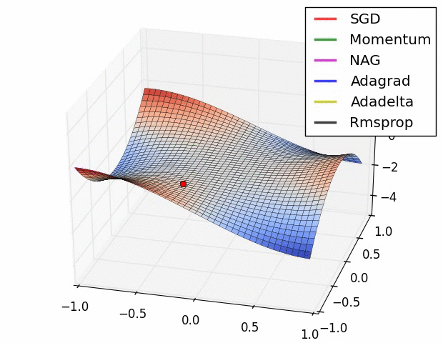
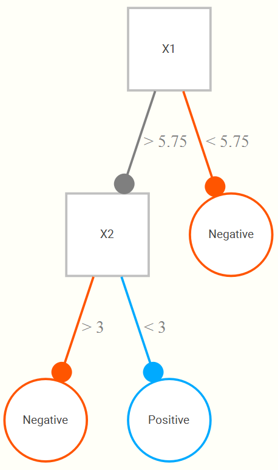
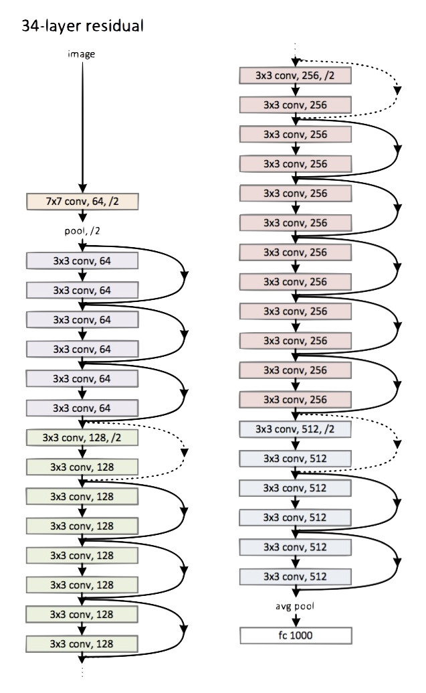

# Machine Learning

`r icon::fa_magic(size = 5, color = '#99002440')`

*Machine learning* (ML) encompasses a wide variety of techniques from standard regression to almost impenetrably complex models.  While it may seem like magic to the uninitiated, the main thing that distinguishes it from standard statistical methods discussed thus far is an approach that heavily favors prediction over inference and explanatory power, and which takes the necessary steps to gain any predictive advantage.  

ML could potentially be applied in any setting, but typically works best with data sets much larger than classical statistical methods are usually applied to.  However, nowadays even complex regression models can be applied to extremely large data sets, and properly applied ML may even work in simpler data settings, so this distinction is muddier than it used to be.  The main distinguishing factor is mostly one of focus.

The following only very briefly provides a demonstration of concepts and approaches.  I have more [in-depth document available](https://m-clark.github.io/introduction-to-machine-learning/) for more details.

## Concepts

### Loss 

We discussed loss functions [before][estimation], and there was a reason I went more in depth there, mainly because I feel, unlike with ML, loss is not explicitly focused on as much in applied research, leaving much to come across as more magical than it should be. In ML however, we are explicitly concerned with loss functions and, more specifically, evaluating loss on test data. This loss is evaluated over successive iterations of a particular technique, or averaged over several test sets via cross-validation.  Typical loss functions are *Root Mean Squared Error* for numeric targets (essentially the same as for a standard linear model), and *cross-entropy* for categorical outcomes.  There are robust alternatives, such as mean absolute error and hinge loss functions respectively, and many other options besides.  You will come across others that might be used for specific scenarios.

The following image, typically called a *learning curve*, shows an example of loss on a test set as a function of model complexity.  In this case, models with more complexity perform better, but only to a point, before test error begins to rise again.

```{r loss, out.width='50%', echo=FALSE}
knitr::include_graphics('img/learningcurve.svg')
```


### Bias-variance Tradeoff

Prediction error, i.e. loss, is composed of several sources. One part is *measurement error*, which we can't do anything about, and two components of specific interest: *bias*, the difference in the observed value and our average predicted value, and *variance* how much that prediction would change had we trained on different data.   ML techniques trade some increased bias for even greater reduced variance, which often means less *overfitting* to the training data, leading to increased performance on new data.

In the following[^biasvar-img-ref] the blue line represents models applied to training data 

```{r bias-var, out.width='50%', echo=FALSE}
knitr::include_graphics('img/biasvar2.svg')
```


### Regularization

As we have noted, a model fit to a single data set might do very well with the data at hand, but then suffer when predicting independent data. Also, oftentimes we are interested in a ‘best’ subset of predictors among a great many, and typically the estimated coefficients from standard approaches are overly optimistic unless dealing with sufficiently large sample sizes. This general issue can be improved by shrinking estimates toward zero, such that some of the performance in the initial fit is sacrificed for improvement with regard to prediction.  The basic idea in terms of the tradeoff is that we are trading some bias for notably reduced variance.


### Cross-validation

*Cross-validation* is widely used for validation and/or testing.  Conceptually there is nothing new beyond what was [discussed previously][Predictive performance] regarding holding out data for assessing predictive performance, we just do more of it. Let's say we split our data into three parts.  We use two parts (combined) as our training data, then the third part as test.  At this point this is identical to our demonstration before.  But then, we switch which part is test and which two are training, and do the whole thing over again.  And finally once more, so that each of our three parts has taken a turn as a test set.  Our estimated error is the average loss across the three times.

```{r cross-validation, out.width='50%', echo=FALSE}
knitr::include_graphics('img/kfold.svg')
```


Typically we do it more than three times, usually 10, and there are fancier methods of *k-fold cross-validation*, though they typically don't serve to add much value.  In any case, let's try it with our previous example.  The following is making use of some relatively new R packages, but the gist is that they allow us to use k-fold cross validation to evaluate the loss.

```{r kfoldcv}
library(tidymodels)

set.seed(1212)

happy_base_spec = linear_reg() %>%
  set_engine(engine = "lm")

happy_folds = vfold_cv(happy)  # yay for non-standard naming!

library(tune)

happy_base_results = fit_resamples(
  happiness_score ~ democratic_quality + generosity + log_gdp_per_capita,
  happy_base_spec,
  happy_folds,
  control = control_resamples(save_pred = TRUE)
)

cv_res = happy_base_results %>%
  collect_metrics()
```

```{r kfoldres-print, echo = F}
cv_res %>% 
  kable_df()
```

We now see that our average test error is `r rnd(cv_res$mean[1])`.  It also gives the average R2.

### Optimization

With ML, much more attention is paid to different optimizers, but the vast majority are some flavor of *stochastic gradient descent*.  Often due to the sheer volume of data/parameters, this optimization is done on part of the data and in parallel.  In general, some optimization approaches may work better in some situations or for some models, where better means quicker convergence, or perhaps a smoother ride toward convergence.  It is not the case that you would come to incorrect conclusions using one method vs. another per se, just that you might reach those conclusions in a more efficient fashion.  The following graphic[^sgd_vis] displays SGD versus variants.  The axes represent the potential values three parameters might take, with the best selection of those values based on a loss function somewhere toward the bottom right.  We can see that they all would get there eventually, but some might do so more quickly.  This may or may not be the case for some other data situation.

```{r optim-vis, echo=FALSE, out.width='50%'}

```


### Tuning parameters

In any ML setting there are parameters that need to set in order to even run the model.  In regularized regression this may be the penalty parameter, for random forests the tree depth, for neural nets, how many hidden units, and many other things.  None of these *tuning parameters* is known beforehand, and so must be tuned, or learned just like any other. This is usually done with through validation process like k-fold cross validation.  The 'best' settings are then used to make final predictions on the test set.


## Techniques

### Regularized regression

A starting point for getting into ML from the more inferential methods is to use *regularized regression*.  These are conceptually no different than standard LM/GLM types of approaches, but they add something to the loss function.

$$\mathcal{Loss} = \Sigma(y - \hat{y})^2 + \lambda\cdot\Sigma\beta^2$$
In the above, this is the same squared error loss function as before, but we add a penalty that is based on the size of the coefficients.  This has the effect of shrinking the estimates toward zero. Well, [why would we want that](https://stats.stackexchange.com/questions/179864/why-does-shrinkage-work)?  This introduces[ bias in the coefficients](https://stats.stackexchange.com/questions/207760/when-is-a-biased-estimator-preferable-to-unbiased-one), but the end result is a model that will do better on test set prediction, which is the goal of the ML approach. The way this works regards the bias-variance tradeoff we discussed previously.  

The following demonstrates regularized regression using the <span class="pack" style = "">glmnet</span> package. It actually uses elastic net, which has a mixture of two penalties, one of which is the squared sum of coefficients and the other is the sum of their absolute values.

```{r glmnet}
library(tidymodels)

happy_prepped = happy %>% 
  select(-country) %>% 
  # drop_na() %>%
  recipe(happiness_score ~ .) %>% 
  step_scale(everything()) %>% 
  prep() %>% 
  bake(happy)

happy_folds = happy_prepped %>% 
  drop_na() %>% 
  vfold_cv() 

library(tune)

happy_regLM_spec = linear_reg(penalty = 1e-3, mixture = 0) %>%
  set_engine(engine = "glmnet")

happy_regLM_results = fit_resamples(
  happiness_score ~ .,
  happy_regLM_spec,
  happy_folds,
  control = control_resamples(save_pred = TRUE)
)

cv_regLM_res = happy_regLM_results %>%
  collect_metrics()

cv_regLM_res
```


### Random Forests

A limitation of standard linear models, especially with many input variables, is that there's not a real automatic way to incorporate interactions and nonlinearities.  So we often will want to use techniques that do so.  To understand *random forests* and similar techniques (boosted trees, etc.), we can start with a simple decision tree.  So, for a single input variable (`X1`) whose range might be 1 to 10, we find that a cut at 5.75 results in the best classification, such that if all observations greater than or equal to 5.75 are classified as positive, and the rest negative. This general approach is fairly straightforward and conceptually easy to grasp, and it is because of this that tree approaches are appealing.

Now let’s add a second input (`X2`), also on a 1 to 10 range. We now might find that even better classification results if, upon looking at the portion of data regarding those greater than or equal to 5.75, that we only classify positive if they are also less than 3 on the second variable. The following is a hypothetical tree reflecting this.

```{r decision-tree, out.width='25%', echo=FALSE}

```


This tree structure allows for both interactions between variables and nonlinear relationships between some input and the target variable.  Random forests randomly select a few from the available input variables, and create a tree that minimizes (maximizes) some loss (objective) function on a validation set.  A given tree can potentially be very wide/deep, but instead of just one tree, we now do, say, 1000 trees. A final prediction is made based on the average across all trees.

(the number of trees is yet another tuning parameter, as is the number of input variables to select for a given tree)., which is a tuning parameter to be set


```{r rf-demo}
happy_rf_spec = rand_forest(mode = 'regression', mtry = 6) %>%
  set_engine(engine = "ranger")

happy_rf_results = fit_resamples(
  happiness_score ~ .,
  happy_rf_spec,
  happy_folds,
  control = control_resamples(save_pred = TRUE)
)

cv_rf_res = happy_rf_results %>%
  collect_metrics()

cv_rf_res
```


### Neural Networks

*Neural networks* have been around for a long while as a general concept in artificial intelligence and even as a machine learning algorithm, and often work quite well. In some sense, neural networks can simply be thought of as nonlinear regression. Visually however, we can see them as a graphical model with layers of inputs and outputs. Weighted combinations of the inputs are created and put through some function (e.g. the sigmoid function) to produce the next layer of inputs. This next layer goes through the same process to produce either another layer, or to predict the output, or even multiple outputs, which serves as the final layer. All the layers between the input and output are usually referred to as hidden layers. If there were a single hidden layer with a single unit and no transformation, then it becomes the standard regression problem.

```{r nn, out.width='50%', echo=FALSE}
knitr::include_graphics('img/nnet.png')
```


As a simple example, we can run a simple neural network with a single hidden layer of 1000 units.  Since this is a regression problem, no further transformation is required.  I set the number of epochs to 500, which you can think of as the number of iterations from our discussion of optimization.  There are many tuning parameters I am not showing that could certainly be fiddled with as well. This is just an example that will run quickly with comparable performance to the previous.  If you do not have <span class="pack" style = "">keras</span> installed, you can change the engine to `nnet`.

```{r nn-demo, cache=TRUE}
happy_nn_spec = mlp(
  mode = 'regression',
  hidden_units = 1000,
  epochs = 500,
  activation = 'linear'
) %>%
  set_engine(engine = "keras")

happy_nn_results = fit_resamples(
  happiness_score ~ .,
  happy_nn_spec,
  happy_folds,
  control = control_resamples(save_pred = TRUE,
                              verbose = FALSE,
                              allow_par = TRUE)
)

cv_nn_res = happy_nn_results %>%
  collect_metrics()

cv_nn_res
```

You will typically see neural nets applied to image and natural language processing, but as demonstrated above, they can be applied in any scenario.  It will take longer to set up and train, but once that's done, you're good to go, and may have a much better predictive result.

#### Deep Learning

*Deep learning* can be summarized succinctly as 'very complicated neural nets'.  Really, that's about it.  The complexity can be quite tremendous however, and there is a wide variety from which to choose.  For example, we just ran a basic neural net above, but for image processing we might use something like resnet, and for natural language processing some LTSM model.  Here is a small(!) version of the convolutional neural network known as 'resnet' which has many layers in between input and output.


```{r resnet, out.width='50%', echo=FALSE}

```


The nice thing is that a lot of the work has already been done for you, and you can use models where most of the layers in the neural net have already been trained by people at Google, Facebook, etc. You only have to worry about the last couple layers for your particular problem.  Applying a pre-trained model to a different data scenario is called *transfer learning*, and regardless of what your intuition is, it will work, and very well.

*Artificial intelligence* used to refer to specific applications of deep/machine learning (e.g. areas in computer vision and natural language processing), but thanks to the popular press, the term has pretty much lost all meaning.  AI actually has a very old history dating to the cognitive revolution in psychology and the early days of computer science in the late 50s and early 60s.  Again though, you can think of it as a subset of the machine learning problems.


## Interpreting the black box

One of the key issues with ML techniques is interpretability.  While a decision tree is immensely interpretable, a thousand of them is not so much.  What any particular node or even layer in a complex neural network represents may be difficult to fathom. However, we can still interpret prediction changes based on input changes, which is what we really care about, and really is not necessarily more difficult than our standard inferential setting.

For example, a regularized regression might not have straightforward inference, but the coefficients are interpreted exactly the same as a standard GLM.  Random forests can have the interactions visualized, which is what we said was required for interpretation in standard settings.  Furthermore, there are many approaches such as *Local Interpretable Model-Agnostic Explanations* (LIME), variable importance measures, Shapley values, and more to help us in this process.  It might take more work, but honestly, in my consulting experience, a great many have trouble interpreting anything beyond a standard linear model any way, and I'm not convinced that it's fundamentally different problem to [extract meaning from the machine learning context](https://christophm.github.io/interpretable-ml-book/) these days, though it may take a little work.


## Machine Learning Summary

## Exercises


[^sgd_vis]: This is [Alec Radford's visualization](https://imgur.com/a/Hqolp).

[^biasvar-img-ref]: This image comes from [Elements of Statistical Learning](https://web.stanford.edu/~hastie/ElemStatLearn/).