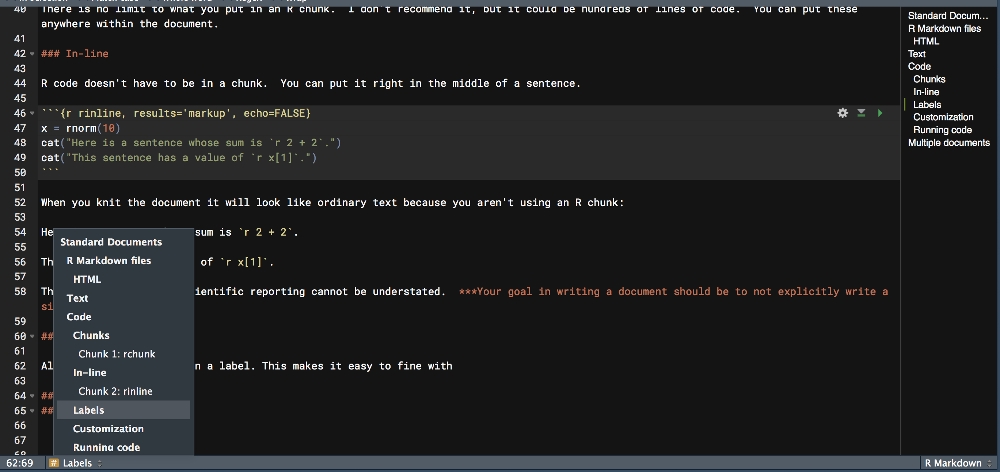
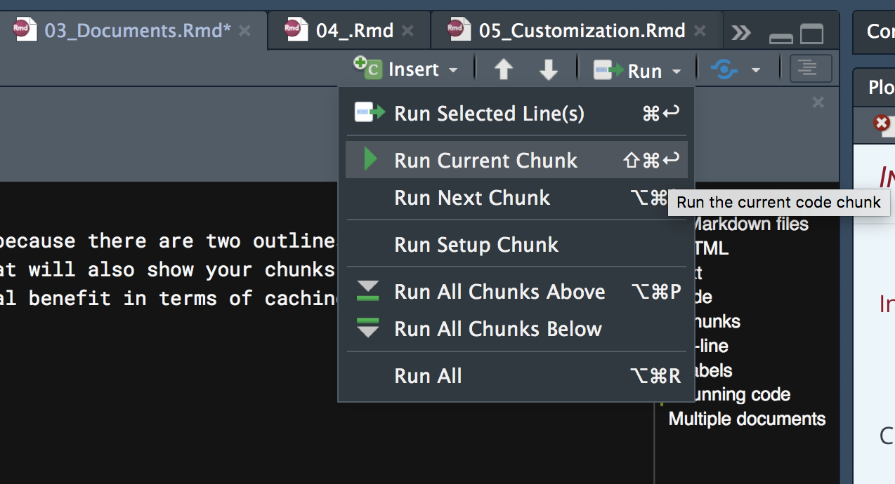

# Standard Documents

## R Markdown files

R Markdown files, with extension `*.Rmd`, are a combination of text, <span class="emph">chunks</span> of R code, and possibly other code or syntax, all within a single file. Various packages, e.g. <span class="pack">rmarkdown</span>, <span class="pack">knitr</span>, <span class="pack">pandoc</span>, etc., work behind the scenes to knit all those pieces into one coherent whole, in whatever format is desired.<span class="marginnote">Pandoc is the universal translator that takes various formats, particularly markup languages, and converts them into others.</span>  The <span class="pack">knitr</span> package is the driving force behind most of what is done to create the final product.

#### HTML

I personally do everything in HTML because it's the most flexible and easiest to get things looking the way you want.  Presumably at some point, these will simply be the default that people both use and expect in the academic realm and beyond, as there is little additional value that one can get with PDF or MS Word, and often notably less.  Furthermore, academia is an anachronism.  How much do you engage PDF and Word for *anything* else relative to how much you make use of HTML (i.e. the web)?


## Text

Writing text in a R Markdown document is the same as anywhere else.  There are a couple things you'll use frequently though.

- Headers: Specified #, ##, ### etc. corresponding to H1 H2 H3 etc.
- Italics & bold:  \**word*\* for italics \*\***word**\*\* for bold.  You can also use underscores (some flavors may require it).
- Links: `[some_text](http://webaddress.com)`
- Image: ``
- Lists: Start with a dash or number, and make sure the first element is separated from any preceding text by a full blank line. Then separate each element by a line.

```
Some *text*.

- List item 1
- List item 2

1. item #1
2. item #2
```

That will pretty much cover most of your basic text needs.  For those that know HTML & CSS, you can use those throughout the text as you desire as well.  For example, sometimes I need some extra space after a plot and will put in a `<br>`.

## Code
### Chunks

Along with text, the most common thing you'll have is code.  The code resides in a <span class="emph">chunk</span>, and looks like this.  You can add it to your document with the `Insert` menu in the upper right of your Rmd file, but as you'll be needing to do this all the time, instead you'll want to use the keyboard shortcut of Ctrl/Cmd + Alt/Option + I[^macshortcuts].

```{r rchunk, echo=FALSE, results='markup'}
cat("```{r}
x = rnorm(10)
```")
```

There is no limit to what you put in an R chunk.  I don't recommend it, but it could be hundreds of lines of code.  You can put these anywhere within the document.  Other languages, e.g. Python, can be used as well, as long as <span class="emph">knitr</span> knows where to look for the engine for the code you want to insert.

### In-line

R code doesn't have to be in a chunk.  You can put it right in the middle of a sentence.

```{r rinline, results='markup', echo=FALSE}
x = rnorm(10)
cat("Here is a sentence whose sum is `r 2 + 2`.")
cat("This sentence has a value of `r x[1]`.")
```

When you knit the document, it will look like ordinary text because you aren't using an R chunk:

Here is a sentence whose sum is `r 2 + 2`.

This sentence has a value of `r x[1]`.

This effect of this in scientific reporting cannot be understated.  

>**Your goal in writing a document should be to not explicitly write a single number that's based on data.**

### Labels

All chunks should be given a label. This makes it easy to find it within your document because there are two outlines available to you. One that shows your text headers (to the right), and one that you can click to reveal that will also show your chunks (bottom left).  If they just say Chunk 1, Chunk 2 etc., it doesn't help you any.  There is also some potential benefit in terms of caching, which we'll discuss later.




### Running code

You don't have to knit the document to run the code, and often you'll be using the results as you write the document. You can run a single chunk or multiple chunks.  Use the shortcuts instead of the menu.



By default, when you knit the document all code will be run.  Depending on a variety of factors, this may or may not be what you want to do, especially if it is time-consuming to do so.  We'll talk about how to deal with this issue in the next part.

## Multiple documents

A single `.Rmd` file can call others, referred to as <span class="emph">child documents</span>, and when you knit that document you'll have one single document with the content from all of them.  You may want to consider other formats, such as <span class="emph">bookdown</span>, rather than doing this.  Scrolling a lot is sometimes problematic, and not actually required for the presentation of material.  It also makes the content take longer to load, because everything has to load[^preload].  See the [appendix][appendix] for details.


## Sharing Code & Collaboration

<span class="emph">R Notebooks</span> are a format one can use that might be more suitable for code collaboration.  They are identical to the standard HTML document in most respects, but chunks will by default print output in the Rmd file itself.  For example, a graduate student could write up a notebook, and their advisor could then look at the document, change the code as needed etc. Of course, you could just do this with a standard R script as well.  Some prefer the inline output however.

For more involved collaborations, I would suggest partitioning the sections into their own document, then use version control to merge respective contributions.  Such a process was designed for software development, but there's no reason it wouldn't work for a document in general, and in my experience, it has quite well.


[^preload]: There is not yet a way within R Markdown that I'm aware of to load on demand as many websites do.  However, waiting for things to load until you come to them is annoying at best, and I usually get tired of waiting and move on to other things.

[^macshortcuts]: As with RStudio in general, Mac shortcuts for R Markdown documents will deviate from the Windows/Linux ones (in mostly unfortunate/inefficient ways).
