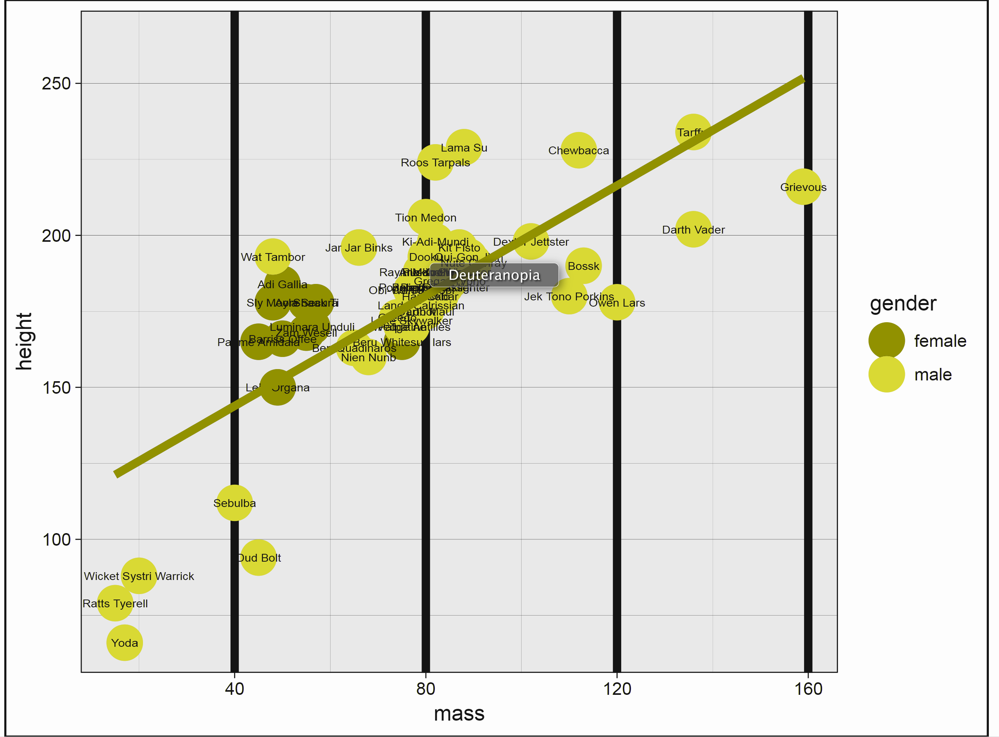
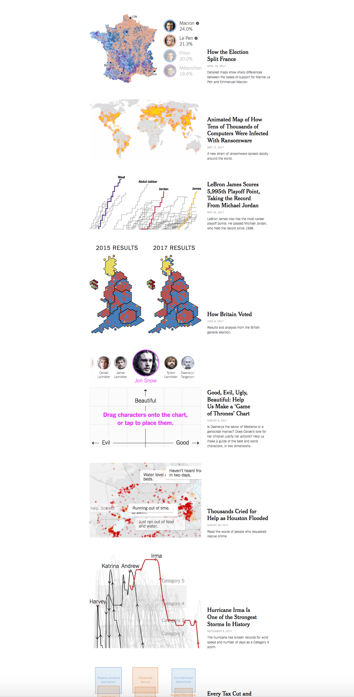
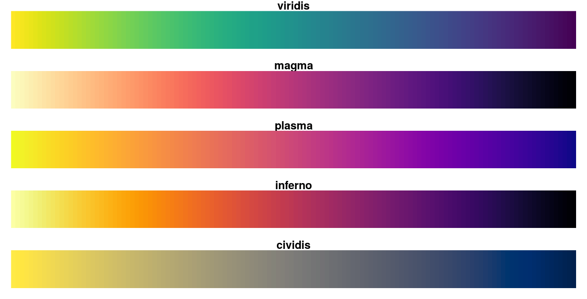
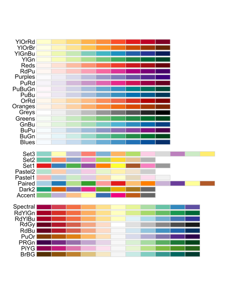
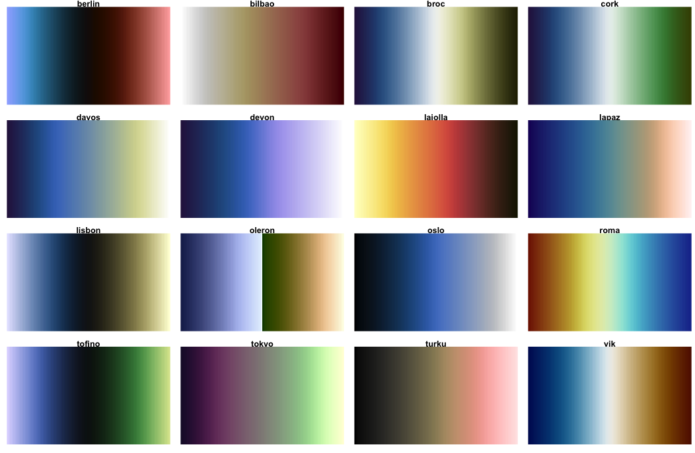
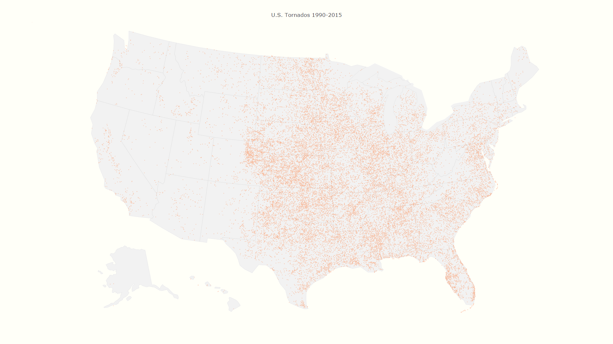
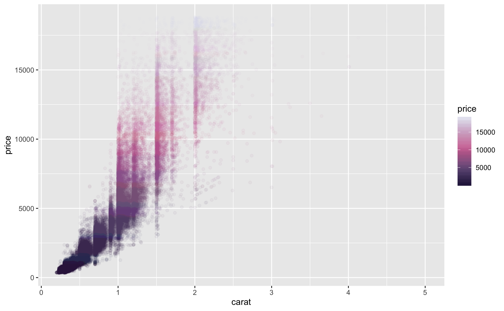
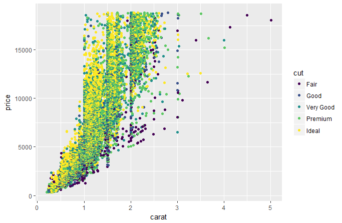

# (PART\*) Part II: Visualization {-}


```{r vissetup, include=FALSE, eval=TRUE, cache=FALSE}
knitr::opts_chunk$set(eval=T, echo=F)
library(viridisLite); library(scico)
```

# Thinking Visually


## Information

A starting point for data visualization regards the information you want to display, and then how you want to display it in order to tell the data's story.  As in statistical modeling, parsimony is the goal, but not at the cost of the more compelling story.  We don't want to waste the time of the audience or be redundant, but we also want to avoid unnecessary clutter, chart junk, and the like. 

We'll start with a couple examples. Consider the following.

```{r problems}
library(plotly)
sw_height = starwars %>% 
  filter(gender %in% c('male', 'female')) %>% 
  group_by(gender) %>% 
  summarise(Height=mean(height, na.rm=T),
            N= n(),
            se = sd(height, na.rm=T)/sqrt(N))
sw_height %>% 
  ggplot(aes(x=gender, y=Height)) +
  geom_bar(aes(), color='black', stat='identity', width=.5) +
  scale_fill_manual(values=c('red1', 'green')) +
  labs(title='Height of Some Star Wars Characters') +
  theme_bw()
```


So what's wrong with this? Plenty. Aside from being boring, the entire story can be said with a couple words- males are taller than females (even in the Star Wars universe). There is no reason to have a visualization. And if a simple group difference is the most exciting thing you have to talk about, not many are going to be interested.

Minor issues can also be noted, including unnecessary border around the bars, unnecessary vertical gridlines, and an unnecessary X axis label.

You might think the following is an improvement, but I would say it's even worse.

```{r problems2}
sw_height %>% 
  ggplot(aes(x=gender, y=Height)) +
  geom_errorbar(aes(ymin=Height-2*se, ymax=Height+2*se),
                width=.2,                    # Width of the error bars
                position=position_dodge(.9)) +
  geom_bar(aes(fill=gender), color='black', stat='identity', width=.5) +
  scale_fill_manual(values=c('red1', 'green')) +
  coord_cartesian(ylim=c(140,200)) +
  labs(title='Height of Some Star Wars Characters') +
  theme_bw()
```

Now the y axis has been changed to distort the difference, perceptually suggesting a height increase of over `r round(((sw_height$Height - 140)[2]/(sw_height$Height - 140)[1] -1)*100)`%.  Furthermore, color is used but the colors are chosen poorly, and add no information, thus making the legend superfluous.  And finally, the above doesn't even convey the information people think it does, assuming they are even standard error bars, which one typically has to guess about in many journal visualizations of this kind[^barerror].


Now we add more information, but more problems!

```{r ugly}
starwars %>% 
  filter(gender %in% c('male', 'female')) %>% 
  ggplot(aes(x=mass, y=height)) +
  geom_point(aes(color=gender), size=6) + 
  geom_text(aes(label=name), size=2) + 
  geom_smooth(method='lm', se=F, color='red', lwd=2) + 
  scale_color_manual(values=c('red1', 'green')) +
  theme_linedraw() +
  theme(plot.background=element_rect(color='black'),
        panel.background=element_rect(fill='gray92'),
        panel.grid.major.x=element_line(size=2)
        )
```

The above has unnecessary border, gridlines, and emphasis. The labels, while possibly interesting, do not relate anything useful to the graph, and many are illegible. It imposes a straight (and too wide of a) straight line on a nonlinear relationship.  And finally, color choice is both terrible and tends to draw one's eye to the female data points.  Here is what it looks like to someone with the most common form of colorblindness. If the points were less clumpy on gender, it would be very difficult to distinguish the groups.




And here is what it might look like when printed.

```{r badbw}
starwars %>% 
  filter(gender %in% c('male', 'female')) %>% 
  ggplot(aes(x=mass, y=height)) +
  geom_point(aes(color=gender), size=6) + 
  geom_text(aes(label=name), size=2) + 
  geom_smooth(method='lm', se=F, color='black', lwd=2) + 
  scale_color_grey(start=.6, end=.4) +
  theme_linedraw() +
  theme(plot.background=element_rect(color='black'),
        panel.background=element_rect(fill='gray92'),
        panel.grid.major.x=element_line(size=2)
        )
```

<br>

Now consider the following.  We have six pieces of information in one graph- name (on hover), homeworld (shape), age (size), gender (color), mass (x), and height (y).  The colors are evenly spaced from one another, and so do not draw one's attention to one group over another, or even to the line over groups. Opacity allows the line to be added and the points to overlap without loss of information.  We technically don't need a caption, legend or gridlines, because hovering over the data tells us everything we'd want to know about a given data point.  The interactivity additionally allows one to select and zoom on specific areas.

<br>

```{r better}
sw2 = starwars %>% 
  filter(gender %in% c('male', 'female')) %>% 
  mutate(homeworld2 = ifelse(homeworld=='Tatooine', 'Tatooine', 'Naboo'),
         homeworld2 = ifelse(homeworld!='Tatooine'& homeworld!='Naboo', 'Other', homeworld2),
         homeworld2 = ifelse(is.na(homeworld2), 'Other', homeworld2)) %>% 
  select(name, mass, height, birth_year, gender, homeworld, homeworld2) %>% ungroup


# adding label=name will add name to plotly tooltip; ggplot will ignore
pal = viridis(3, begin = 0, end = .75, direction = 1, option = 'plasma') # direction evidently doesn't work
linecol = scales::alpha(pal[1], .5)# because plotly doesn't know what alpha is.
g = sw2 %>% 
  select(-homeworld) %>% 
  rename(homeworld=homeworld2) %>% 
  ggplot(aes(x=mass, y=height)) +
  geom_smooth(color=linecol, se=F, size=.5, alpha=.5) +
  geom_point(aes(label=name, color=gender, shape=homeworld, size=birth_year), alpha=.5, show.legend=F) +
  scale_color_manual(values=pal[2:3]) +
  # geom_text(aes(label=name)) +
  scale_size_continuous(range=c(2,10)) +
  theme_clean()+ 
  theme(legend.position="none")  # only way to keep plotly from putting a legend

ggplotly()%>% 
  layout(title='Star Wars Characters',
         font=list(family='Roboto'),
         xaxis=list(title='Mass'),
         yaxis=list(title='Height')) %>% 
  theme_plotly()
```

<br>

Whether this particular scheme is something you'd prefer or not, the point is that we get quite a bit of information without being overwhelming, and the data is allowed to express itself cleanly.

Here are some things to keep in mind when creating visualizations for scientific communication.

### Your audience isn't dumb

Assume your audience, which in academia is full of people with advanced degrees or those aspiring to obtain one, and in other contexts comprises people who are interested in your story, can handle more than a bar graph.  If the visualization is good and well-explained[^captions], they'll be fine. 

See the data visualization and maps sections of [2017: The Year in Visual Stories and Graphics](https://www.nytimes.com/interactive/2017/12/21/us/2017-year-in-graphics.html) at the New York Times.  Good data visualization of even complex relationships can be appreciated by more than an academic audience.  Assume you can at least provide visualizations on that level of complexity and be okay.  It won't always work, but at least put the same effort you'd appreciate yourself.



### Clarity is key

Sometimes the clearest message *is* a complicated one.  That's okay, science is an inherently fuzzy process.  Make sure your visualization tells the story you think is important, and don't dumb the story down in the visualization.  People will likely remember the graphic before they'll remember the table of numbers.

By the same token, don't needlessly complicate something that is straightforward.  Perhaps a scatter plot with some groupwise coloring is enough.  That's fine.

All of this is easier said than done, and there is no right way to do data visualizations.  Prepare to experiment, and focus on visuals that display patterns that will be more readily perceived.

### Avoid clutter

In striving for clarity, there are pitfalls to avoid. Gridlines, 3d, unnecessary patterning, and <span class="emph">chartjunk</span> in general will only detract from the message.  As an example, gridlines might even seem necessary, but even faint ones can potentially hinder the pattern recognition you hope will take place, perceptually imposing clumps of data that do not exist.  In addition, they practically insist on a level of data precision that in many situations you simply don't have.  What's more, with interactivity they literally convey nothing additional, as a simple hover-over or click on a data point will reveal the precise values.  Use sparingly, if at all.

### Color isn't optional

It's odd for me to have to say this, as it's been the case for many years, but no modern scientific outlet should be a print-first outfit, and if they are, you shouldn't care to send your work there.  The only thing you should be concerned with is how it will look online, because that's how people will interact with your work first and foremost.  That means that color is essentially a requirement for any visualization, so use it well in yours.

### Think interactively

It might be best to start by making the visualization *you want to make*, with interactivity and anything else you like.  You can then reduce as necessary for publication or other outlets, and keep the fancy one as supplemental, or accessible on your own website to show off.


## Color

There is a lot to consider regarding color.  Until recently, the default color schemes of most visualization packages were poor at best.  Thankfully, <span class="pack">ggplot2</span>, its imitators and extenders, in both the R world and beyond, have made it much easier to have a decent color scheme by default[^jet].

However, the defaults are still potentially problematic, so you should be prepared to go with something else.  In other cases, you may just simply prefer something else.  For example, for me, the gray background of <span class="pack">ggplot2</span> defaults is something I have to remove for every plot[^hadleygray].

### Viridis

A couple packages will help you get started in choosing a decent color scheme.  One is <span class="pack">viridis</span>.  As stated in the package description:

> These color maps are designed in such a way that they will analytically be perfectly perceptually-uniform, both in regular form and also when converted to black-and-white. They are also designed to be perceived by readers with the most common form of color blindness.

So basically you have something that will take care of your audience without having to do much. There are four palettes.




These color schemes might seem a bit odd from what you're used to.  But recall that the goal is good communication, and these will allow you to convey information accurately, without implicit bias, and be acceptable in different formats. In addition, there is <span class="pack">ggplot2</span> functionality to boot, e.g. <span class="func">scale_color_viridis</span>, and it will work for discrete or continuously valued data.

For more, see the [vignette](https://cran.r-project.org/web/packages/viridis/vignettes/intro-to-viridis.html). I also invite you to watch the [introduction of the original module in Python](https://www.youtube.com/watch?v=xAoljeRJ3lU), where you can learn more about the issues in color selection, and why viridis works.

### RColorBrewer

Color Brewer offers another collection of palettes that will generally work well in a variety of situations.  While there are print and color-blind friendly palettes, not all adhere to those restrictions.  Specifically though, you have palettes for the following data situations:

- Qualitative (e.g. Dark2[^Dark1])
- Sequential (e.g. Reds)
- Diverging (e.g. RdBu)



There is a <span class="pack">ggplot2</span> function, <span class="func">scale_color_brewer</span>, you can use as well. For more, see [colorbrewer.org](http://colorbrewer2.org/).  There you can play around with the palettes to help make your decision.

<div class='note'>
In R, you have three schemes that work well right out of the box:

- ggplot2 default palette
- viridis
- RColorBrewer

Furthermore, they'll work well with discrete or continuous data.  You will have to do some work to come up with better, so they should be your default.  Sometimes though, [one can't help oneself](https://github.com/m-clark/NineteenEightyR).

 
</div>

### Scientific colors

Yet another set of palettes are available via the <span class="pack">scico</span> package, and are specifically geared toward for scientific presentation. These perceptually-uniform color maps will handle data variations equally all along the colour bar and still work for black and white print. Just another option beyond viridis palettes.


- Perceptually uniform     
- Perceptually ordered     
- Color-vision-deficiency friendly     
- Readable as black-and-white print


 

## Contrast

<span class="" style="color:#B3B3B3">Thankfully, websites have mostly gotten past the phase where there text looks like this</span>.  The goal of scientific communication is to, well, *communicate*.  Making text hard to read is pretty much antithetical to this.

So contrast comes into play with text as well as color.  In general, you should consider a 7 to 1 contrast ratio for text, minimally 4 to 1.


-<span class="" style="color:#B3B3B3; size:150%; font-weight:500">Here is text at 2 to 1</span>

-<span class="" style="color:#7f7f7f; size:150%; font-weight:500">Here is text at 4 to 1</span>

-<span class="" style="color:#585858; size:150%; font-weight:500">Here is text at 7 to 1</span> (this document)

-<span class="" style="color:black; size:150%; font-weight:500">Here is black</span>

I personally don't like stark black, and find it visually irritating, but obviously that would be fine to use for most people.

Contrast concerns regard color as well.  When considering color, one should consider the background for plots, or perhaps the surrounding text.  The following function will check for this. Ideally one would pass AAA.

```{r contrast, echo=TRUE}
# default ggplot2 discrete color against the default ggplot2 gray background
visibly::color_contrast_checker(foreground = '#F8766D', background = 'gray92')

# the dark viridis would work 
visibly::color_contrast_checker(foreground = '#21908C', background = 'gray92')
```

You can't win all battles however.  It will be difficult to choose colors that are perceptually even, avoid color-blindness issues, have good contrast, and work to convey the information you need.  The main thing is to make the attempt.


## Scaling Size

You might not be aware, but there is more than one way to scale the size of objects, e.g. in a scatterplot. Consider the following, where in both cases dots are scaled by the person's body-mass index (BMI).


```{r scale_size, out.width='50%'}
sw2 %>% 
  mutate(bmi = mass/((height/100)^2)) %>% 
  ggplot(aes(x=mass, y=height)) +
  geom_point(aes(label=name,  size=bmi), color=palettes$orange$orange, alpha=.25, show.legend=F) +
  scale_size_continuous(range=c(2,10)) +
  theme_clean()+ 
  theme(legend.position="none")  # only way to keep plotly from putting a legend
sw2 %>%
  mutate(bmi = mass/((height/100)^2)) %>% 
  ggplot(aes(x=mass, y=height)) +
  geom_point(aes(label=name, size=bmi), color=palettes$orange$orange, alpha=.25, show.legend=F) +
  scale_radius(range=c(2,10)) + 
  theme_clean()+ 
  theme(legend.position="none")  # only way to keep plotly from putting a legend
```


What's the difference? The first plot scales the dots by their area, while the second scales the radius, but otherwise they are identical.  It's not generally recommended to scale the radius, as our perceptual system is more attuned to the area.  Packages like <span class="pack">ggplot2</span> and <span class="pack">plotly</span> will automatically do this, but some might not, so you should check.


## Transparency

Using transparency is a great way to keep detailed information available to the audience without being overwhelming. Consider the following.  Fifty individual trajectories are shown on the left, but it doesn't cause any issue graphically.  The right has 10 lines plus a fitted line, 20 points and a ribbon to provide a sense of variance.  Using transparency and a viridis color scheme allows it to be perceived cleanly.

```{r transp_old, eval=FALSE}
N = 100
obs = 10

g = rep(1:N, e=obs)
x = rep(1:obs, N)
f = rep(c(-.5, .5), e=N/2)[g]
# sig = createCorr(c(-.75,-.25,.25))
# re = mvtnorm::rmvnorm(N, sigma=sig)
re = mvtnorm::rmvnorm(N, sigma=diag(c(.5,.05,.025)))
y = re[,1][g] + (.25+re[,2][g])*x + (re[,3][g]*f)*(x^2) + rnorm(N*obs, sd=.2)
library(lme4)
xsq = x^2
lmer(y ~ x + xsq + (1+x+xsq |g))
# y = scale(y)[,1]

# lm(y~poly(x,2)) %>% summary()

# 
# gg = tibble(g, x, y) %>% 
#   mutate(y = scale(y)) %>% 
#   ggplot(aes(x,y)) + 
#   geom_smooth(aes(group=g), se=F, color=alpha(palettes$orange$orange, .2), lwd=.5)
# ggplotly() %>% 
#   theme_plotly()
tibble(g, f=factor(f, labels=c('g1','g2')), x, y) %>% 
  group_by(g) %>% 
  mutate(updown = if_else(last(y) > first(y), 'up', 'down')) %>% 
  # ungroup() %>%
  plot_ly() %>% 
  add_lines(x=~x, y=~y,  color=~f, opacity=.25, showlegend=F) %>%
  add_markers(x=~x, y=~y, color=~f, opacity=.75) %>% 
  theme_plotly()
```

```{r transp, out.width='75%', fig.asp=.5}
########################################################################################
### 'Noisy' gaussian process demo.  The matrix labeling is in keeping with Murphy    ###
### 2012 and Rasmussen and Williams 2006.  See those sources for more detail.        ###
### Murphy's matlab code can be found here: https://code.google.com/p/pmtk3/, though ###
### the relevant files are housed alongside this code.                               ###
###                                                                                  ###
### The goal of this code is to plot samples from the prior and posterior predictive ###
### of a gaussian process in which y = sin(x) + noise. It will reproduce an example  ###
### akin to figure 15.3 in Murphy 2012.                                              ###
########################################################################################


#################
### Functions ###
#################

# the mean function; in this case mean=0
muFn = function(x){
  x = sapply(x, function(x) x=0)
  x
}

# The covariance function; here it is the squared exponential kernel.
# l is the horizontal scale, sigmaf is the vertical scale, sigman the noise.
# See ?covSEiso in the gpr package for example, which is also based on Rasmussen and
# Williams Matlab code (gpml Matlab library)

Kfn = function(x, y=NULL, l=1, sigmaf=1, sigman=.5){
  if(!is.null(y)){
    sigmaf * exp( -(1/(2*l^2)) * as.matrix(dist(x, upper=T, diag=T)^2) ) + sigman*diag(length(x))    
  }
  else{
    sigmaf * exp( -(1/(2*l^2)) * as.matrix(dist(x, upper=T, diag=T)^2) )
  }  
}

#####################
### Preliminaries ###
#####################
set.seed(1234)
l = 1           # for l, sigmaf, sigman, see note at covariance function
sigmaf = 1      
sigman = .25 
keps = 1e-8     # see note at Kstarstar
nprior = 50      # number of prior draws
npostpred = 10   # number of posterior predictive draws

##################
### Prior plot ###
##################

### data setup
xg1 = seq(-5, 5, .2)
yg1 = mvtnorm::rmvnorm(nprior, 
                       mean=muFn(xg1), 
                       sigma=Kfn(xg1, l=l, sigmaf=sigmaf, sigman=sigman)) 

### plot
# reshape data for plotting
# pal = viridis::plasma(4)
# scico::scico_palette_show()
pal = scico::scico(4, end = .75, palette = 'turku')
gdat1 = data.frame(
  x = xg1,
  y = t(yg1),
  sd = apply(yg1, 2, sd)
) %>% 
  pivot_longer(
    starts_with('y'),
    names_to = 'variable',
    values_to = 'value')

g1 = ggplot(aes(x = x, y = value), data = gdat1) +
  geom_line(aes(group = variable, alpha = abs(value)),
            color = pal[2],
            show.legend = F) +
  scale_alpha_continuous(range = c(.15, .25)) +
  labs(title = 'Prior') +
  theme_clean() +
  theme(axis.text.x=element_blank(),
        axis.text.y=element_blank(),
        axis.line = element_blank(),
        axis.ticks.x=element_blank(),
        axis.ticks.y=element_blank(),
        axis.title.x=element_blank(),
        axis.title.y=element_blank())

# g1 # show plot

####################################
### generate noisy training data ###
####################################

Xtrain = 15*(runif(20)-.5)  
nTrain = length(Xtrain)
ytrain = sin(Xtrain) + rnorm(n=nTrain, sd=.1)  # kept sine function for comparison to noise free result

Xtest = seq(-7.5, 7.5, length=200)
nTest = length(Xtest)

#####################################
### generate posterior predictive ###
#####################################

### Create Ky, K*, and K** matrices as defined in the texts
Ky = Kfn(x=Xtrain, y=ytrain, l=l, sigmaf=sigmaf, sigman=sigman)
K_ = Kfn(c(Xtrain, Xtest), l=l, sigmaf=sigmaf, sigman=sigman)                    # initial matrix
Kstar = K_[1:nTrain, (nTrain+1):ncol(K_)]                                        # dim = N x N*
tKstar = t(Kstar)                                                                # dim = N* x N
Kstarstar = K_[(nTrain+1):nrow(K_), (nTrain+1):ncol(K_)] + keps*diag(nTest)      # dim = N* x N*; the keps part is for positive definiteness
Kyinv = solve(Ky)

# calculate posterior mean and covariance
postMu = muFn(Xtest) + tKstar %*% Kyinv %*% (ytrain-muFn(Xtrain))
postCov = Kstarstar - tKstar %*% Kyinv %*% Kstar
s2 = diag(postCov)
# R = chol(postCov)  
# L = t(R)      # L is used in alternative formulation below based on gaussSample.m

# generate draws from posterior predictive
y2 = data.frame(t(mvtnorm::rmvnorm(npostpred, mean=postMu, sigma=postCov)))
# y2 = data.frame(replicate(npostpred, postMu + L %*% rnorm(postMu))) # alternative

#################################
### Posterior predictive plot ###
#################################

# reshape data for plotting
gdat2 = data.frame(
  x = Xtest,
  y = y2,
  fmean = postMu,
  selower = postMu - 2 * sqrt(s2),
  seupper = postMu + 2 * sqrt(s2)
) %>%
  pivot_longer(
    starts_with('y'),
    names_to = 'variable',
    values_to = 'value'
  )

g2 = ggplot(aes(x=x, y=value), data=gdat2) + 
  geom_ribbon(aes(ymin=selower, ymax=seupper,group=variable), fill=pal[1], alpha=.01) +
  geom_line(aes(group=variable), color=pal[2], alpha=.25) +
  geom_line(aes(group=variable, y=fmean), color=pal[3], size=1, alpha=.5) +
  geom_point(aes(x=Xtrain, y=ytrain), color=pal[4], alpha=1, size=2, data=data.frame(Xtrain, ytrain)) +
  labs(title='Posterior Predictive') +
  theme_clean() +
  theme(axis.text.x=element_blank(),
        axis.text.y=element_blank(),
        axis.line = element_blank(),
        axis.ticks.x=element_blank(),
        axis.ticks.y=element_blank(),
        axis.title.x=element_blank(),
        axis.title.y=element_blank())

# g2

####################################################
### Plot prior and posterior predictive together ###
####################################################

# there is no way with knitr to control the size of this grid object in a
# logical fashion. The bookdown notes on figures did not work even remotely as
# described. The only success was found with out.width + fig.asp, so that was
# set as a default knitr setting
library(patchwork)
g1 + g2
```


Without transparency, it just looks ugly, and notably busier if nothing else. This plot is using the exact same <span class="pack">scico</span> palette.

```{r transp2, out.width='75%', fig.asp=.5}
g1 = ggplot(aes(x = x, y = value), data = gdat1) +
  geom_line(aes(group = variable), color = pal[2], alpha = 1) +
  labs(title = 'Prior') +
  theme_void()

g2 = ggplot(aes(x = x, y = value), data = gdat2) +
  geom_ribbon(
    aes(ymin = selower, ymax = seupper, group = variable),
    fill = pal[1],
    alpha = 1
  ) +
  geom_line(aes(group = variable), color = pal[2], alpha = 1) +
  geom_line(
    aes(group = variable, y = fmean),
    color = pal[3],
    size = 1,
    alpha = 1
  ) +
  geom_point(
    aes(x = Xtrain, y = ytrain),
    color = pal[4],
    alpha = 1,
    size = 2,
    data = data.frame(Xtrain, ytrain)
  ) +
  labs(title = 'Posterior Predictive') +
  theme_void()

g1 + g2
```


In addition, transparency can be used to add additional information to a plot. In the following scatter plot, we can get a better sense of data density from the fact that the plot is darker where points overlap more.

<!--  -->

```{r transp_tornado, eval=T}
# depending on the plot, plotly may confuse opacity with some other quality of the color
# data(flights, package='threejs') 
# flights %>% 
#   plot_ly(x=~origin_long, y=~origin_lat) %>% 
#   add_markers(opacity=.20, size=I(3), color=I('#ff5500')) %>% 
#   theme_plotly()
# 
# load('../../Other/Tornado/data/tornados.RData')
# g <- list(
#   scope = 'usa',
#   projection = list(type = 'albers usa'),
#   showland = TRUE,
#   landcolor = toRGB("gray95"),
#   subunitcolor = toRGB("gray85"),
#   countrycolor = toRGB("gray85"),
#   countrywidth = 0.5,
#   subunitwidth = 0.5
# )
# 
# tornados %>% 
#   filter(Year>=2010) %>% 
#   plot_geo(lat = ~StartLat, lon = ~StartLon) %>%
#   add_markers(marker=list(size = 5), color=I('#ff5500'), opacity=.25) %>%
#   layout(title = 'U.S. Tornados 1990-2015', geo = g) %>% 
#   theme_plotly()

library(mclust)
sim_faithful = Mclust(faithful, G=2) %>% summary()

nsim = 500
g1 = mvtnorm::rmvnorm(nsim, sim_faithful$mean[,1], sigma=sim_faithful$variance[,,1])
g2 = mvtnorm::rmvnorm(nsim, sim_faithful$mean[,2], sigma=sim_faithful$variance[,,2])
gdat = data.frame(rbind(g1, g2), group=rep(0:1, e=nsim)) 

gdat %>%
  ggplot(aes(x=waiting, y=eruptions)) +
  geom_point(size = 3, alpha=.10, color='#ff5500') +
  theme_clean()
```

Here we apply transparency to a density plot to convey a group difference in distributions, while still being able to visualize the whole distribution of each group.

```{r transp_density}
detach(package:mclust)
set.seed(123)
gdat = 1:4 %>% 
  map(~rnorm(20, mean=.x, sd=.x/2)) %>% 
  data.frame() %>% 
  rename_all(function(x) paste0('x', 1:4)) %>% 
  pivot_longer(everything(), names_to = 'g', values_to = 'value') %>% 
  mutate(g = fct_relevel(g, 'x1', after=2))

gdat %>% 
  ggplot(aes(x=value, group=g)) +
  geom_density(aes(color=g, fill=g), alpha=.2, show.legend=F) +
  xlim(-3,10) +
  theme_clean() +
  theme(axis.text.x=element_blank(),
        axis.text.y=element_blank(),
        axis.ticks.x=element_blank(),
        axis.ticks.y=element_blank(),
        axis.title.x=element_blank(),
        axis.title.y=element_blank())
```

Had we not done so, we might not be able to tell what's going on with some of the groups at all.

```{r transp_density2}
gdat %>%
  ggplot(aes(x = value, group = g)) +
  geom_density(aes(color = g, fill = g), show.legend = F) +
  xlim(-3, 10) +
  theme_clean() +
  theme(
    axis.text.x = element_blank(),
    axis.text.y = element_blank(),
    axis.ticks.x = element_blank(),
    axis.ticks.y = element_blank(),
    axis.title.x = element_blank(),
    axis.title.y = element_blank()
  )
```


In general, a good use of transparency can potentially help any visualization, but consider it especially when trying to display many points, or otherwise have overlapping data.

## Accessibility

Among many things (apparently) rarely considered in typical academic or other visualization is <span class="emph">accessibility</span>.  The following definition comes from the <span class="emph">World Wide Web Consortium</span>.

> Web accessibility means that people with disabilities can use the Web. More specifically, Web accessibility means that people with disabilities can perceive, understand, navigate, and interact with the Web, and that they can contribute to the Web. Web accessibility also benefits others, including older people with changing abilities due to aging.

The main message to get is that not everyone is able to use the web in the same manner.  While you won't be able to satisfy everyone who might come across your work, putting a little thought into your offering can go along way, and potentially widen your audience.

We talked about this previously, but when communicating visually, one can do simple things like choosing a colorblind-friendly palette, or using a font contrast that will make it easier on the eyes of those reading your work.  There are even browser plugins to test your web content for accessibility. In addition, there are little things like adding a title to inserted images, making links more noticeable etc., all of which can help consumers of your information.

## File Types

It's one thing to create a visualization, but at some point you're likely going to want to share it.  RStudio will allow for the export of any visualization created in the Plots or Viewer tab.  In addition, various packages may have their own save function, that may allow you to specify size, type or other aspects.  Here we'll discuss some of the options.

- <span class="emph">png</span>: These are relatively small in size and ubiquitous on the web. You should feel fine in this format.  It does not scale however, so if you make a smaller image and someone zooms, it will become blurry.
- <span class="emph">gif</span>: These are the type used for all the silly animations you see on the web.  Using them is fine if you want to make an animation, but know that it can go longer than a couple seconds, and there is no requirement for it to be asinine.
- <span class="emph">jpg</span>: Commonly used for photographs, which isn't the case with data generated graphs.  Given their relative size I don't see much need for these.
- <span class="emph">svg</span>: These take a different approach to imaging and can scale. You can make a very small one and it (potentially) can still look great when zoomed in to a much larger size. Often useful for logos, but possibly in any situation.

As I don't know what screen will see my visualizations, I generally opt for svg.  It may be a bit slower/larger, but in my usage and for my audience size, this is of little concern relative to it looking proper. They also work for pdf if you're still creating those, and there are also lighter weight versions in R, e.g. <span class="pack">svglite</span>.  Beyond that I use png, and have no need for others.

Here is a [discussion on stackexchange](https://stackoverflow.com/questions/2336522/png-vs-gif-vs-jpeg-vs-svg-when-best-to-use) that summarizes some of the above. The initial question is old but there have been recent updates to the responses.

Note also, you can import files directly into your documents with R, HTML tags, or $\LaTeX$.  See `?png` for a starting point.  The following demonstrates an image insert for HTML output, with a couple options for centering and size.

``


## Summary

The goal of this section was mostly just to help you realize that there are many things to consider when visualizing information and attempting to communicate the contents of data.  The approach is not the same as what one would do in say, an artistic venture, or where there is nothing specific to impart to an audience. Even some of the most common things you see published are fundamentally problematic, so you can't even use what people traditionally do as a guide.  However, there are many tools available to help you.  Another thing to keep in mind is that there is no right way to do a particular visualization, and many ways, to have fun with it.


## A casual list of things to avoid

I'm just putting things that come to mind here as I return to this document. Mostly it is personal opinion, though often based on various sources in the data visualization realm or simply my own experience.  

### Pie

Pie charts and their cousins, e.g. bar charts (and stacked versions), wind rose plots, radar plots etc., either convey too little information or make otherwise simple information more difficult to process perceptually.

### Histograms

Anyone that's used R's <span class="func">hist</span> function knows the frustration here.  Use density plots instead.  They convey the same information but better, and typical defaults are usually fine.

### Using 3D without adding any communicative value

You will often come across use of 3D in scientific communication which is fairly poor and makes the data harder to interpret.  In general, when going beyond two dimensions, your first thought should be to use color, size, etc. and finally, prefer interactivity to 3D.  Where it is useful is in things like showing structure (e.g. molecular, geographical), or continuous multi-way interactions.

### Using too many colors 

Some put a completely non-scientifically based number on this, but the idea holds. For example, if you're trying to show U.S. state grouping by using a different color for all 50 states, no one's going to be able to tell the yellow for Alabama vs. the slightly different yellow for Idaho.  Alternatives would be to show the information via a map or use a hover over display.

### Showing maps that just display population

Most of the maps I see on the web cover a wide range of data and can be very visually appealing, but pretty much just tell me where the most populated areas are, which is utterly uninteresting.  Make sure that your geographical depiction is more informative than this.


### Biplots

A lot of folks doing PCA resort to biplots for interpretation, where a graphical model would be much more straightforward.  See [this chapter](http://m-clark.github.io/sem/latent-variables-1.html) for example.


## Thinking Visually Exercises

### Exercise 1

The following uses the <span class="objclass">diamonds</span> data set that comes with <span class="pack">ggplot2</span>.  Use the <span class="func">scale_color_viridis</span> function to add a more accessible palette.

```{r thinkingvis_ex1, echo=T, eval=FALSE, cache=FALSE}
library(ggplot2); library(viridis)
ggplot(aes(x=carat, y=price), data=diamonds) +
  geom_point(aes(color=price)) +
  ????
```

```{r thinkingvis_ex1b, eval=F, out.width='50%'}
library(ggplot2); library(viridis)
ggplot(aes(x=carat, y=price), data=diamonds) +
  geom_point(aes(color=price)) +
  scale_color_viridis()
```



### Exercise 2

Now color it by the `cut`.  To use the scale_color_viridis approach, you'll have to change one of the arguments to the function (set `discrete=T`).  Reproduce this but using one of the other viridis palettes.  See the helpfile via `?scale_color_viridis` to see how to change the palette.

```{r thinkingvis_ex2, eval=FALSE, out.width='50%'}
ggplot(aes(x=carat, y=price), data=diamonds) +
  geom_point(aes(color=cut)) +
  scale_color_viridis(discrete=T)
```



### Thinking exercises

For your upcoming presentation, *who* is your audience?


[^barerror]: Error bars for group means can overlap and still be statistically different (the test regards the *difference* in means).  Furthermore visuals of this sort often don't bother to say whether it is standard deviation, standard error, or 2*standard error, or even something else.

[^captions]: People seem to think there are text limits for captions.  There are none.

[^jet]: Even Matlab finally joined the club, except that they still screwed up with their default coloring scheme.

[^hadleygray]: Hadley states "The grey background gives the plot a similar colour (in a typographical sense) to the remainder of the text, ensuring that the graphics fit in with the flow of a text without jumping out with a bright white background. Finally, the grey background creates a continuous field of colour which ensures that the plot is perceived as a single visual entity.".  The part about it being ugly is apparently left out. ☺  Also, my opinion is that it has the opposite effect, making the visualization jump out because nothing on the web is typically gray by default. If anything the page background is white, and having a white/transparent background would perhaps be better, but honestly, don't you *want* a visualization to jump out?

[^Dark1]: Don't even think about asking what the Dark1 palette is.